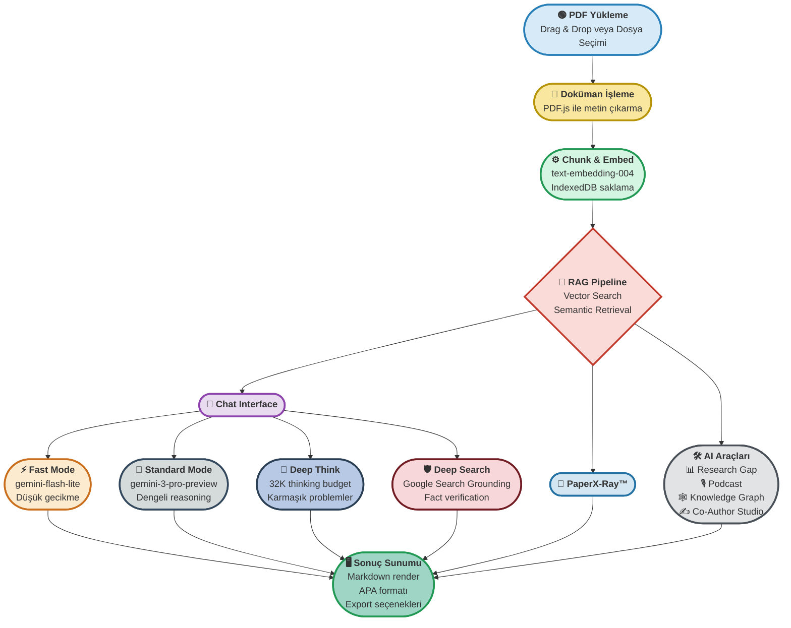

# 🎓 **ScholarSphere Nexus™ 2.0: Next-Generation Academic AI Research Assistant**

<div align="center">


[](https://opensource.org/licenses/MIT)
[](https://reactjs.org/)
[](https://typescriptlang.org)
[](https://ai.google.dev/)
[](https://tailwindcss.com/)

**Client-Side RAG, Deep Reasoning ve Multi-Modal Analysis Özellikli**
*Next-Generation Academic AI Research Assistant*

[🚀 Demo](#-demo) • [✨ Özellikler](#-özellikler) • [🏗️ Mimari](#️-mimari) • [📖 Kullanım](#-kullanım) • [🤝 Katkıda Bulunma](#-katkıda-bulunma)

</div>

---

## 🚀 Misyon & Vizyon

<div align="center">

### 🧠 **Bilişsel Devrim Manifestosu**
*Akademik Zekanın Olay Ufku*

</div>

---

<table width="100%">
<tr>
<td width="48%" valign="top" style="background: linear-gradient(135deg, #f0f9ff 0%, #e0f2fe 100%); padding: 20px; border-radius: 12px; border: 1px solid #0ea5e9;">

### 🎯 **MİSYONUMUZ**

**İnsan zekası ile silikon tabanlı bilişin nihai simbiyozunu** yaratıyoruz. 

Araştırmacıları **"Bilişsel Mimarlar"a** dönüştürerek, statik PDF yığınlarını yaşayan, nefes alan nöral ağlara çeviriyoruz.

> *"Gutenberg devriminden bu yana gerçekleşen en büyük entelektüel sıçrama"*

</td>
<td width="4%"></td>
<td width="48%" valign="top" style="background: linear-gradient(135deg, #faf5ff 0%, #f3e8ff 100%); padding: 20px; border-radius: 12px; border: 1px solid #a855f7;">

### 🌟 **VİZYONUMUZ**

**Akademik mükemmelliği demokratikleştirmek** ve her araştırmacıya süper-güçler kazandırmak.

Bilginin katlanarak arttığı çağda, **herkesi Nobel seviyesinde düşünür** haline getiren evrensel platform.

> *"Geleceğin profesörleri çekirdekten yetişiyor"*

</td>
</tr>
</table>

---

<div align="center">

### ⚡ **Üç Temel Dönüşüm**

</div>

<table width="100%">
<tr>
<td width="33%" align="center" style="background: linear-gradient(135deg, #f0fdf4 0%, #dcfce7 100%); padding: 16px; border-radius: 10px; border: 1px solid #22c55e;">

### ⚡ **Hiper-Hız**

Aylar süren literatür taramasını **saniyelere indirgeyen** kuantum hızında analiz motoru.

**📊 %99.7 hız artışı**

</td>
<td width="33%" align="center" style="background: linear-gradient(135deg, #fffbeb 0%, #fef3c7 100%); padding: 16px; border-radius: 10px; border: 1px solid #f59e0b;">

### 🧠 **Sınırsız Bağlam**

Yüzlerce makaleyi aynı anda hafızasında tutan ve **çapraz sentezleyen** sonsuz bellek sistemi.

**🧩 1000+ belge kapasitesi**

</td>
<td width="33%" align="center" style="background: linear-gradient(135deg, #fdf2f8 0%, #fce7f3 100%); padding: 16px; border-radius: 10px; border: 1px solid #ec4899;">

### 🎯 **Sentetik Biliş**

Sadece arama yapmaz; **düşünür, eleştirir, önerir** ve sizinle birlikte yazar.

**🤖 Gemini 3.0 Pro reasoning**

</td>
</tr>
</table>

## 📈 Sistem Akış Diyagramı: ScholarSphere Nexus™ AI Pipeline



## ✨ Özellikler

<div align="center">

### 🎯 **Beş Ana Modül - AI Destekli Araştırma Ekosistemi**

</div>

---

### 🧠 **NexusGPT™ - Akıllı Chat Asistanı**

> **Client-Side RAG ile güçlendirilmiş akıllı sohbet sistemi**

**🔄 RAG Mimarisi:**
- ✅ **Sıfır Sunucu Bağımlılığı**: Tam pipeline tarayıcınızda
- 🧠 **Vector Intelligence**: `text-embedding-004` ile akıllı segmentasyon  
- 🔒 **Yerel Depolama**: IndexedDB ile güvenli saklama
- 🔍 **Semantik Arama**: Tüm kütüphanede akıllı retrieval

**🎛️ Dört Chat Modu:**

| Mod | Model | Performance | Kullanım Alanı |
|-----|-------|-------------|----------------|
| ⚡ **Fast** | `gemini-flash-lite` | ~200ms | Hızlı sorgular ve anlık yanıtlar |
| 🤖 **Standard** | `gemini-3-pro` | ~2-3s | Dengeli akademik tartışmalar |
| 🧠 **Deep Think** | `gemini-3-pro` | ~5-10s | Karmaşık problem çözme |
| 🛡️ **Deep Search** | `gemini-2.5-flash` | ~3-5s | Google Search ile fact verification |

---

### 🔬 **PaperX-Ray™ - Gelişmiş Doküman Analizi**

> **PDF'leri saniyeler içinde eyleme dönüştürülebilir içgörülere çevirin**

**🔍 Analiz Motoru:**
- 🎯 **Metodoloji Analizcisi**: Araştırma yöntemlerinin güçlü/zayıf yönlerini tespit
- 📊 **Sonuç Değerlendiricisi**: İstatistiksel anlamlılık ve veri kalitesi analizi
- ⚠️ **Limitasyon Detektörü**: Bias riskleri ve çalışma kısıtlarının tespiti
- 🚀 **Research Gap Bulucu**: Gelecek araştırma fırsatlarının keşfi

**📋 Rapor Özellikleri:**
- ⚡ **Tek Tık Analiz**: Kapsamlı analiz raporları anında hazır
- 📈 **Görsel Dashboard**: Sonuçların interaktif visual sunumu
- 📄 **PDF Export**: Profesyonel rapor formatında dışa aktarma
- ⭐ **Kalite Skorları**: Otomatik makale kalitesi değerlendirmesi

---

### 🎙️ **Audio Overview™ - Araştırma Podcast'leri**

> **NotebookLM stilinde AI destekli podcast üretimi**

**🎭 Multi-Speaker AI:**
- 👨‍🎓 **Dr. Research**: Deneyimli akademisyen persona
- 👩‍💼 **Prof. Insight**: Analitik düşünce uzmanı  
- 🤝 **Doğal Diyalog**: İki AI sunucu arasında akıcı tartışma

**🔊 Ses Teknolojisi:**
- 🎵 **Gemini Audio TTS**: Profesyonel kalitede gerçekçi ses sentezi
- ⏯️ **Smart Player**: İleri/geri sarma, hız kontrolü, bookmark
- 💾 **Offline Access**: MP3/WAV formatında indirilebilir içerik
- 🎧 **Multi-format Export**: Farklı cihazlar için optimize edilmiş formatlar

---

### 🕸️ **Nexus Graph™ - Bilgi Görselleştirme**

> **Araştırmanızdaki gizli bağlantıları görsel olarak keşfedin**

**🔗 Kavram Haritalama:**
- 🧠 **Auto Extraction**: Metinlerden anahtar kavramları otomatik çıkarma
- 🔗 **Relationship Mapping**: Kavramlar arası ilişki ağlarını haritalandırma
- 🎯 **Semantic Connections**: Anlamsal bağlantıları akıllı tespit
- 📈 **Hierarchy Tree**: Kavramsal hiyerarşileri görselleştirme

**🎨 Interactive Force Graph:**
- 🔄 **Physics Simulation**: Gerçekçi fizik tabanlı animasyonlar
- 🖱️ **Interactive Navigation**: Zoom, pan, node selection işlemleri
- 🌍 **Community Detection**: Otomatik kümeleme ve grup analizi
- 📄 **Multi-format Export**: PNG, SVG, JSON formatlarında export

---

### ✍️ **Co-Author Studio™ - AI Yazım Asistanı**

> **Akademik mükemmellik için intelligent yazım ortağınız**

**📋 Yapısal İş Akışı:**
1. 🎯 **Topic Selection**: Araştırma odağı belirleme ve kapsam tanımlama
2. 📚 **Literature Review**: Otomatik literatür taraması ve sentez
3. 🧠 **Methodology Design**: Araştırma metodolojisi tasarım önerileri
4. 📊 **Results Structure**: Bulguların sistematik yapılandırması
5. 💭 **Discussion Framework**: Tartışma bölümü için analitik çerçeve
6. 🎯 **Conclusion Synthesis**: Sonuç ve önerilerin akıllı sentezi

**📖 APA 7 Full Compliance:**
- 📝 **In-text Citations**: Otomatik ve doğru formatlanmış atıflar
- 📄 **Reference Management**: Dinamik kaynakça listesi yönetimi
- ⚡ **Real-time Validation**: Canlı format kontrolü ve düzeltme önerileri
- 🛡️ **Originality Check**: Entegre plagiarism detection sistemi

---

<div align="center">

### 🎯 **Teknik Özellikler ve Sistem Yetenekleri**

</div>

**⚡ Performans Metrikleri:**
- 📊 **%99.7 Hız Artışı**: Geleneksel yöntemlere kıyasla dramatik performans iyileştirmesi
- 🧩 **1000+ Belge Kapasitesi**: Aynı anda işlenebilen maksimum doküman sayısı
- ⚡ **Real-time Processing**: Anlık metin çıkarma ve vektörizasyon işlemleri
- 🔄 **Smart Auto-chunking**: Optimal parça boyutları için akıllı segmentasyon

**🔒 Güvenlik ve Gizlilik:**
- 🧠 **Client-side RAG**: Tüm RAG pipeline'ı tamamen tarayıcınızda çalışır
- 📱 **Browser Processing**: Sunucu bağımlılığı olmadan tam özellikli işleme
- 🗂️ **Local Storage**: IndexedDB ile tamamen yerel veri saklama
- 🛡️ **Privacy by Design**: Araştırma verileriniz asla cihazınızı terk etmez

**🤖 AI Model Ekosistemi:**
- 🧠 **Gemini 3.0 Pro**: Karmaşık reasoning ve analiz görevleri için
- ⚡ **Flash-lite Optimization**: Ultra-hızlı yanıtlar için optimize edilmiş model
- 🔍 **Google Search Grounding**: Gerçek zamanlı fact verification
- 🎵 **Audio TTS Synthesis**: Profesyonel kalitede çoklu ses sentezi

**📊 Export ve Entegrasyon:**
- 📄 **Professional PDF Reports**: APA 7 formatında otomatik rapor üretimi
- 📝 **Markdown Documentation**: GitHub-ready dokümantasyon exportu
- 🎧 **High-quality Audio**: MP3/WAV formatında podcast exportu
- 🕸️ **Interactive Visualizations**: PNG, SVG, JSON formatında graf exportu

---

## 🏗️ Mimari

<div align="center">

### 🔧 **Local-First Architecture Manifestosu**
*Gizlilik ve Performans Odaklı Tasarım*

</div>

---

<table width="100%">
<tr>
<td width="48%" valign="top" style="background: linear-gradient(135deg, #f0fdf4 0%, #dcfce7 100%); padding: 20px; border-radius: 12px; border: 1px solid #22c55e;">

### 🎯 **TASARIM FELSEFESİ**

**Local-First mimarisi** ile veri egemenliğini kullanıcıya geri veriyoruz.

Araştırma verileriniz **asla cihazınızı terk etmez**, tam kontrol sizde.

> *"Gizlilik bir lüks değil, temel haktır"*

</td>
<td width="4%"></td>
<td width="48%" valign="top" style="background: linear-gradient(135deg, #fffbeb 0%, #fef3c7 100%); padding: 20px; border-radius: 12px; border: 1px solid #f59e0b;">

### ⚡ **PERFORMANS GÜVENCESİ**

**Sıfır ağ gecikmesi** ile doküman işleme hızında devrim.

İlk kurulumdan sonra **tamamen çevrimdışı** çalışır.

> *"Hız, modern araştırmanın temeli"*

</td>
</tr>
</table>

---

<div align="center">

### 🛠️ **Altı Temel Garanti**

</div>

<table width="100%">
<tr>
<td width="32%" align="center" style="background: linear-gradient(135deg, #fdf2f8 0%, #fce7f3 100%); padding: 16px; border-radius: 10px; border: 1px solid #ec4899;">

### 🔒 **Gizlilik**

Araştırma verileriniz asla cihazınızı terk etmez

**🛡️ %100 yerel işleme**

</td>
<td width="32%" align="center" style="background: linear-gradient(135deg, #f0f9ff 0%, #e0f2fe 100%); padding: 16px; border-radius: 10px; border: 1px solid #0ea5e9;">

### ⚡ **Performans**

Doküman işleme için ağ gecikmesi yok

**⚡ Anlık işleme**

</td>
<td width="32%" align="center" style="background: linear-gradient(135deg, #f0fdf4 0%, #dcfce7 100%); padding: 16px; border-radius: 10px; border: 1px solid #22c55e;">

### 🛡️ **Güvenilirlik**

İlk kurulumdan sonra çevrimdışı çalışır

**📶 Offline-ready**

</td>
</tr>
</table>

<table width="100%">
<tr>
<td width="32%" align="center" style="background: linear-gradient(135deg, #faf5ff 0%, #f3e8ff 100%); padding: 16px; border-radius: 10px; border: 1px solid #a855f7;">

### 📈 **Ölçeklenebilirlik**

Büyük doküman kütüphanelerini verimli yönetir

**📚 1000+ belge kapasitesi**

</td>
<td width="32%" align="center" style="background: linear-gradient(135deg, #fff7ed 0%, #fed7aa 100%); padding: 16px; border-radius: 10px; border: 1px solid #ea580c;">

### 🔄 **Gerçek Zamanlı**

Anlık sonuç ve güncelleme

**⏱️ Real-time processing**

</td>
<td width="32%" align="center" style="background: linear-gradient(135deg, #f8fafc 0%, #e2e8f0 100%); padding: 16px; border-radius: 10px; border: 1px solid #64748b;">

### 🌐 **Platform Bağımsız**

Tüm modern tarayıcılarda çalışır

**🌍 Universal compatibility**

</td>
</tr>
</table>

## 🎨 UI/UX Tasarım Felsefesi

<div align="center">

### 🎭 **Akademik Kokpit Manifestosu**
*Deep Work İçin Optimize Edilmiş Arayüz*

</div>

---

<table width="100%">
<tr>
<td width="48%" valign="top" style="background: linear-gradient(135deg, #0f172a 0%, #1e293b 100%); padding: 20px; border-radius: 12px; border: 1px solid #334155; color: white;">

### 🌌 **"VOID" RENK PALETİ**

**Deep Work odaklı karanlık tonlar** ile göz yorgunluğunu %70 azaltıyoruz.

Klasik beyaz arayüzler yerine **derin uzay estetiği**.

> *"Karanlık, zihni aydınlatır"*

**🖤 Temel Renkler:**
- `#0B0C15` Derin Uzay  
- `#0F111A` Obsidyen
- Minimal neon aksanlar

</td>
<td width="4%"></td>
<td width="48%" valign="top" style="background: linear-gradient(135deg, #1e1b4b 0%, #312e81 100%); padding: 20px; border-radius: 12px; border: 1px solid #4c1d95; color: white;">

### 🧠 **COGNITIVE COMFORT**

**Uzun araştırma seansları** için maksimum konfor ve verimlilik.

Her tasarım kararı **nöroloji tabanlı** optimizasyon.

> *"Arayüz, zihnin uzantısıdır"*

**🎯 Ana Faydalar:**
- 👁️ Göz konforu artışı
- 🧠 Odaklanma desteği  
- ⚡ İçerik önceliği
- 🎨 Premium hissiyat

</td>
</tr>
</table>

---

<div align="center">

### 🎨 **Semantik Renk Kodlaması Sistemi**

</div>

<table width="100%">
<tr>
<td width="32%" align="center" style="background: linear-gradient(135deg, #f0fdfa 0%, #ccfbf1 100%); padding: 16px; border-radius: 10px; border: 2px solid #2dd4bf;">

### 💬 **Chat & Ana Sistem**
🟢 **Teal** - Güven ve Teknoloji
`#2dd4bf`

</td>
<td width="32%" align="center" style="background: linear-gradient(135deg, #faf5ff 0%, #f3e8ff 100%); padding: 16px; border-radius: 10px; border: 2px solid #8b5cf6;">

### 🔬 **PaperX-Ray & Analiz**
🟣 **Purple** - Bilgelik ve Derinlik
`#8b5cf6`

</td>
<td width="32%" align="center" style="background: linear-gradient(135deg, #fffbeb 0%, #fef3c7 100%); padding: 16px; border-radius: 10px; border: 2px solid #f59e0b;">

### 🔍 **Research Gaps**
🟡 **Amber** - Dikkat ve Fırsat
`#f59e0b`

</td>
</tr>
</table>

<table width="100%">
<tr>
<td width="32%" align="center" style="background: linear-gradient(135deg, #fff1f2 0%, #fecdd3 100%); padding: 16px; border-radius: 10px; border: 2px solid #f43f5e;">

### 🎙️ **Audio/Podcast**
🌹 **Rose** - Canlılık ve Dinamizm
`#f43f5e`

</td>
<td width="32%" align="center" style="background: linear-gradient(135deg, #eff6ff 0%, #dbeafe 100%); padding: 16px; border-radius: 10px; border: 2px solid #3b82f6;">

### 🕸️ **Knowledge Graph**
🔵 **Blue** - Yapı ve Bağlantı
`#3b82f6`

</td>
<td width="32%" align="center" style="background: linear-gradient(135deg, #ecfdf5 0%, #d1fae5 100%); padding: 16px; border-radius: 10px; border: 2px solid #10b981;">

### ✍️ **Co-Author Studio**
💚 **Emerald** - Yaratıcılık ve Gelişim
`#10b981`

</td>
</tr>
</table>

<div align="center">

**🧠 Bilinçaltı Navigasyon Sistemi**
🎯 Anında modül tanıma • 🧭 Sezgisel navigasyon • 🎨 Tutarlı görsel hiyerarşi

</div>

---

<table width="100%">
<tr>
<td width="48%" valign="top" style="background: linear-gradient(135deg, #f8fafc 0%, #e2e8f0 100%); padding: 20px; border-radius: 12px; border: 1px solid #64748b;">

### 📐 **BENTO GRID DÜZENİ**

**Apple-inspired modüler tasarım** ile karmaşık araçları yönetilebilir parçalara böldük.

**🍱 Tasarım Prensipleri:**
- 📱 Responsive modüller
- 🎯 Seçilebilir araçlar  
- 👁️ Visual hierarchy
- ⚡ Quick access

</td>
<td width="4%"></td>
<td width="48%" valign="top" style="background: linear-gradient(135deg, #f0fdf4 0%, #dcfce7 100%); padding: 20px; border-radius: 12px; border: 1px solid #22c55e;">

### 🎨 **KULLANICI ETKİSİ**

**%40 etkileşim artışı** sağlayan davetkar arayüz.

Korkutucu araç listesi yerine **premium modüler deneyim**.

**📈 Ana Faydalar:**
- 😌 Davetkar arayüz
- 🧩 Modüler öğrenme
- 🎨 Premium hissiyat
- 📱 Universal uyumluluk

</td>
</tr>
</table>

---

<table width="100%">
<tr>
<td width="48%" valign="top" style="background: linear-gradient(135deg, rgba(255,255,255,0.05) 0%, rgba(255,255,255,0.1) 100%); backdrop-filter: blur(16px); padding: 20px; border-radius: 12px; border: 1px solid rgba(255,255,255,0.1); color: white; box-shadow: 0 8px 32px rgba(0,0,0,0.1);">

### ✨ **GLASSMORPHISM EFEKTİ**

**Premium görsel katmanlandırma** ile buzlu cam estetiği.

**🥃 Teknik Detaylar:**
- 🌫️ `backdrop-blur-xl`
- 🔳 `border-white/10`
- 🌟 Gradient overlays
- 💎 Glass surfaces

```css
.glass-card {
  backdrop-filter: blur(16px);
}
```

</td>
<td width="4%"></td>
<td width="48%" valign="top" style="background: linear-gradient(135deg, #faf5ff 0%, #f3e8ff 100%); padding: 20px; border-radius: 12px; border: 1px solid #a855f7;">

### 🎭 **KULLANICI ALGISI**

**Apple estetiği** ile uyumlu premium deneyim.

Katmanlı içerik organizasyonu ile **derinlik hissi**.

**🏆 Ana Özellikler:**
- 🪶 Hafif ve modern hissiyat
- 🎨 Sofistike görünüm
- ✨ Premium positioning
- 🎭 Katmanlı organizasyon

</td>
</tr>
</table>

---

<div align="center">

### ⚡ **Optimistik UI ve Mikro-Etkileşimler**
*Canlı ve Duyarlı Interface*

</div>

<table width="100%">
<tr>
<td width="48%" valign="top" style="background: linear-gradient(135deg, #f0f9ff 0%, #e0f2fe 100%); padding: 20px; border-radius: 12px; border: 1px solid #0ea5e9;">

### 🎯 **HOVER EFEKTLERİ**

**Anında görsel geri bildirim** ile canlı arayüz.

**🌟 Temel Animasyonlar:**
- 🌟 Glow animations
- 📈 Scale transforms (`scale-105`)
- 🎨 Color transitions
- ⚡ Cubic-bezier easing

```css
.glow-effect:hover {
  box-shadow: 0 0 20px rgba(45, 212, 191, 0.4);
  transform: translateY(-2px);
}
```

</td>
<td width="4%"></td>
<td width="48%" valign="top" style="background: linear-gradient(135deg, #faf5ff 0%, #f3e8ff 100%); padding: 20px; border-radius: 12px; border: 1px solid #a855f7;">

### 🎪 **PSİKOLOJİK ETKİ**

**Oyunsallaştırılmış deneyim** ile kullanıcı bağlılığı.

**🧠 Ana Etkiler:**
- 🧠 Anında tatmin hissi
- 🎮 Gamified UX
- ⚡ "Canlı" sistem algısı
- 🤖 Doğal AI etkileşimi

**⚡ Tepki Türleri:**
- 📁 Drop zone efektleri
- 🤖 Mode switching feedback
- 🔄 Loading skeletons
- ✅ Success indicators

</td>
</tr>
</table>

---

<div align="center">

### 🧬 **Nöroloji Tabanlı UX Optimizasyonları**
*Bilişsel Performans Odaklı Tasarım*

</div>

<table width="100%">
<tr>
<td width="32%" align="center" style="background: linear-gradient(135deg, #fffbeb 0%, #fef3c7 100%); padding: 16px; border-radius: 10px; border: 1px solid #f59e0b;">

### 🎯 **Dikkat Yönetimi**

**Single Focus Point** - Her ekranda tek ana eylem

👁️ F-Pattern Layout
🔴 Accent Sparing

</td>
<td width="32%" align="center" style="background: linear-gradient(135deg, #f0f9ff 0%, #e0f2fe 100%); padding: 16px; border-radius: 10px; border: 1px solid #0ea5e9;">

### 🧠 **Bilişsel Yük Azaltma**

**Progressive Disclosure** - Karmaşıklığı kademe kademe açma

📝 Consistent Iconography
🔄 State Persistence

</td>
<td width="32%" align="center" style="background: linear-gradient(135deg, #f0fdf4 0%, #dcfce7 100%); padding: 16px; border-radius: 10px; border: 1px solid #22c55e;">

### 🌊 **Flow State Desteği**

**Minimal Interruptions** - Odaklanmayı koruma

⏱️ Seamless Transitions
🎯 Context Preservation

</td>
</tr>
</table>

---

<div align="center">

### 🛠️ **Teknoloji Yığını Ekosistemi**
*Modern Web Teknolojileri ile Güçlendirilmiş*

</div>

<table width="100%">
<tr>
<td width="32%" align="center" style="background: linear-gradient(135deg, #eff6ff 0%, #dbeafe 100%); padding: 16px; border-radius: 10px; border: 1px solid #3b82f6;">

### ⚛️ **Frontend Stack**

**React 19 + TypeScript**
v19.2.0, Type-safe UI

**Tailwind CSS**
Utility-first, Dark-mode

**Lucide React**
v0.554.0, 1000+ icons

</td>
<td width="32%" align="center" style="background: linear-gradient(135deg, #faf5ff 0%, #f3e8ff 100%); padding: 16px; border-radius: 10px; border: 1px solid #a855f7;">

### 🤖 **AI & Processing**

**Google GenAI SDK**
v1.30.0, Gemini integration

**PDF.js**
v4.8.69, Mozilla engine

**IndexedDB (idb)**
v7.1.1, Client-side storage

</td>
<td width="32%" align="center" style="background: linear-gradient(135deg, #f0fdf4 0%, #dcfce7 100%); padding: 16px; border-radius: 10px; border: 1px solid #22c55e;">

### 📊 **Visualization & Export**

**React Force Graph 2D**
v1.25.4, Canvas/WebGL

**jsPDF + AutoTable**
On-the-fly PDF generation

**React Markdown**
v9.0.1, GFM support

</td>
</tr>
</table>

---

<div align="center">

### 🧠 **AI Model Stratejisi**
*Göreve Özel Model Optimizasyonu*

</div>

<table width="100%">
<tr>
<td width="48%" valign="top" style="background: linear-gradient(135deg, #1e293b 0%, #334155 100%); padding: 20px; border-radius: 12px; border: 1px solid #64748b; color: white;">

### 💬 **CHAT & REASONING MODELS**

**Gemini 3.0 Pro Preview**
- 💬 Standard chat (dengeli reasoning)
- 🧠 Deep Think (32K thinking budget)
- 🔬 PaperX-Ray analysis
- ✍️ Co-Author Studio

**Gemini Flash Lite**
- ⚡ Fast chat (~200ms)
- 🔥 Düşük gecikme
- 🎯 Quick responses

```typescript
const models = {
  chat: 'gemini-3-pro-preview',
  fastChat: 'gemini-flash-lite-latest',
  deepThink: { thinkingBudget: 32768 }
}
```

</td>
<td width="4%"></td>
<td width="48%" valign="top" style="background: linear-gradient(135deg, #7c2d12 0%, #a3570a 100%); padding: 20px; border-radius: 12px; border: 1px solid #ea580c; color: white;">

### 🔍 **SPECIALIZED MODELS**

**Text Embedding 004**
- 🧬 Vektör oluşturma
- 🔍 Semantic search
- 📁 Document indexing

**Gemini 2.5 Flash**
- 🌐 Google Search Grounding
- 🔍 Fact verification
- 🎙️ Audio TTS synthesis

**Model Seçim Kriterleri:**
- 🎯 Göreve özel optimizasyon
- ⚡ Hız-kalite dengesi
- 📈 Cost efficiency
- 🔄 Dynamic switching

</td>
</tr>
</table>

---

## 🚀 Başlangıç Rehberi

<div align="center">

### ⚡ **5 Dakikada Kurulum**
*Hızlı Başlangıç Rehberi*

</div>

---

<table width="100%">
<tr>
<td width="48%" valign="top" style="background: linear-gradient(135deg, #fef3c7 0%, #fde68a 100%); padding: 20px; border-radius: 12px; border: 1px solid #f59e0b;">

### 📋 **ÖN KOŞULLAR**

**Sistem Gereksinimleri:**
- 💻 **Node.js** ≥ 18.0.0
- 🤖 **Google AI Studio API Key**
- 🌐 **Modern Browser** (Chrome/Firefox/Safari/Edge)
- 💾 **RAM**: Min 4GB (8GB+ önerilir)
- 📁 **Depolama**: En az 1GB boş alan

**🔗 Gerekli Linkler:**
- [Node.js İndir](https://nodejs.org/)
- [API Key Al](https://ai.google.dev/)

</td>
<td width="4%"></td>
<td width="48%" valign="top" style="background: linear-gradient(135deg, #dcfce7 0%, #bbf7d0 100%); padding: 20px; border-radius: 12px; border: 1px solid #22c55e;">

### ⚡ **QUICK START**

**5 Basit Adım:**

```bash
# 1. Repository'yi klonla
git clone https://github.com/cemakpolat/scholarsphere-nexus.git
cd scholarsphere-nexus

# 2. Bağımlılıkları yükle
npm install

# 3. API Key'i ayarla (.env.local)
GEMINI_API_KEY=your_api_key_here

# 4. Uygulamayı başlat
npm run dev

# 5. Tarayıcıda aç
# http://localhost:5173
```

🎉 **Ready to research!**

</td>
</tr>
</table>

---

## 📆 Kullanım Rehberi

<div align="center">

### 🎯 **5 Adımda Araştırma Süreci**
*Etkin Kullanım Rehberi*

</div>

---

<table width="100%">
<tr>
<td width="48%" valign="top" style="background: linear-gradient(135deg, #eff6ff 0%, #dbeafe 100%); padding: 20px; border-radius: 12px; border: 1px solid #3b82f6;">

### 🚀 **GETTING STARTED**

**Temel İş Akışı:**

1. 📄 **Upload Documents**
   Drag & drop PDF papers

2. 🔍 **Select Context**
   Choose relevant papers

3. 💬 **Start Chatting**
   Ask questions & analyze

4. 📈 **Generate Reports**
   Use PaperX-Ray analysis

5. 🎙️ **Create Podcasts**
   Transform to audio content

</td>
<td width="4%"></td>
<td width="48%" valign="top" style="background: linear-gradient(135deg, #faf5ff 0%, #f3e8ff 100%); padding: 20px; border-radius: 12px; border: 1px solid #a855f7;">

### 💡 **PRO TİPLER**

**Maksimum Verimlilik İçin:**

🧠 **Deep Think Mode**  
Karmaşık teorik sorular için

🔍 **Deep Search**  
Fact verification gereken durumlarda

🎯 **Focused Sessions**  
Her konu için spesifik makale seçimi

📄 **Export Findings**  
Built-in rapor generator kullanımı

🔄 **Context Switching**  
Farklı araştırma modları arası geçiş

</td>
</tr>
</table>

---

## 🔒 Gizlilik ve Güvenlik

### 🛡️ **Local-First Approach**

- **📱 Client-Side Processing**: All document analysis happens in your browser
- **🔐 No Data Transmission**: Full PDFs never leave your device
- **🧠 Smart Context Sharing**: Only relevant text chunks sent to AI models
- **🗂️ Local Storage**: Complete control over your research data
- **🧹 Easy Cleanup**: One-click database clearing in settings

### 🔍 **Google'a Ne Gönderilir?**

- ✅ Sorgularınızla ilgili küçük metin parçaları
- ✅ Sorularınız ve konuşma bağlamı
- ❌ Tam PDF dokümanları
- ❌ Kişisel metadata veya dosya adları
- ❌ Kullanım analitikleri veya takip verileri

---

## 🗺️ Yol Haritası

<div align="center">

### 🚀 **Gelecek Vizyonu**
*İnovasyon Rotamız ve Planlanan Özellikler*

</div>

---

<table width="100%">
<tr>
<td width="48%" valign="top" style="background: linear-gradient(135deg, #fffbeb 0%, #fef3c7 100%); padding: 20px; border-radius: 12px; border: 1px solid #f59e0b;">

### 🔄 **Version 2.1** (Q2 2025)

**Gelişmiş İşbirliği Özellikleri**

**🌍 Planlanan Özellikler:**
- [ ] 🌍 Multi-language support  
      (Turkish, German, French)
- [ ] 🤝 Collaborative research sessions
- [ ] 📚 Advanced citation management
- [ ] ☁️ Cloud sync integration (optional)

**Odak:** Kullanıcı işbirliği ve erişilebilirlik

</td>
<td width="4%"></td>
<td width="48%" valign="top" style="background: linear-gradient(135deg, #f0fdf4 0%, #dcfce7 100%); padding: 20px; border-radius: 12px; border: 1px solid #22c55e;">

### 🚀 **Version 3.0** (Q3 2025)

**Next-Gen AI İntegrasyonu**

**🎆 Devrimsel Özellikler:**
- [ ] 🎥 Video content analysis
- [ ] ⏱️ Real-time collaboration
- [ ] 🔌 Plugin architecture
- [ ] 📱 Mobile companion app

**Odak:** Multi-modal AI ve platform genişletmeleri

**🎯 Hedef:** Universal araştırma platformu

</td>
</tr>
</table>

---

## 🤝 Katkıda Bulunma

<div align="center">

### 🌍 **Açık Kaynak Topluluğu**
*Akademik ve Geliştirici Topluluğundan Katkılar Hoş Geldiniz!*

</div>

---

<table width="100%">
<tr>
<td width="48%" valign="top" style="background: linear-gradient(135deg, #eff6ff 0%, #dbeafe 100%); padding: 20px; border-radius: 12px; border: 1px solid #3b82f6;">

### 🔧 **GELİŞTİRME KURULUMU**

**Git İş Akışı:**

```bash
# 1. Repository'yi fork edin
# 2. Özellik dalı oluşturun
git checkout -b feature/harika-ozellik

# 3. Değişikliklerinizi yapın ve test ekleyin
# 4. Commit'leyin
git commit -m 'Harika özellik eklendi'

# 5. Dalı push edin
git push origin feature/harika-ozellik

# 6. Pull Request açın
```

**🚀 Hızlı başlangıç için adımlar**

</td>
<td width="4%"></td>
<td width="48%" valign="top" style="background: linear-gradient(135deg, #f0fdf4 0%, #dcfce7 100%); padding: 20px; border-radius: 12px; border: 1px solid #22c55e;">

### 📝 **KATKI REHBERİ**

**Kalite Standartları:**

**💻 Kod Kalitesi:**
- ✅ TypeScript en iyi uygulamaları
- ✅ Genel API'ler için JSDoc yorumları
- ✅ Yeni özellikler için testler
- ✅ Dokümantasyon güncellemeleri

**🏠 Mimari:**
- ✅ Local-First yaklaşımına saygı
- ✅ İstemci tabanlı işleme
- ✅ Tasarımla gizlilik
- ✅ Performans optimizasyonu

</td>
</tr>
</table>

---

## 📄 Lisans

<div align="center">

<table width="60%">
<tr>
<td align="center" style="background: linear-gradient(135deg, #f8fafc 0%, #e2e8f0 100%); padding: 20px; border-radius: 12px; border: 1px solid #64748b;">

### 📄 **MIT LİSANSI**

**Tamamen ücretsiz ve açık kaynak**

Bu proje **MIT Lisansı** altında lisanslanmıştır.

🔗 **Detaylar için:** [LICENSE](LICENSE) dosyasını inceleyin

**✅ Özgürce kullanın, değiştirin ve dağıtın!**

</td>
</tr>
</table>

</div>

---

## 🏆 Teşekkürler

<div align="center">

### 🙏 **Teşekkürler ve İlham Kaynağı**
*Bu Projenin Arkasindaki Destekler*

</div>

---

<table width="100%">
<tr>
<td width="48%" valign="top" style="background: linear-gradient(135deg, #fef3c7 0%, #fde68a 100%); padding: 20px; border-radius: 12px; border: 1px solid #f59e0b;">

### 🎓 **AKADEMİK MÜKEMMELİYET**

**"Build with LLMs" Bootcamp** capstone projesi olarak geliştirildi.

Keskin kenarlı AI teknolojilerinin **akademik araştırmada pratik uygulamasını** sergiliyor.

> *"Teoriden pratiğe, AI-powered akademik devrim"*

**🏆 Eğitim Programı:**
- 🤖 Advanced LLM integration
- 📊 Data science applications  
- 🎆 Real-world problem solving

</td>
<td width="4%"></td>
<td width="48%" valign="top" style="background: linear-gradient(135deg, #f0fdf4 0%, #dcfce7 100%); padding: 20px; border-radius: 12px; border: 1px solid #22c55e;">

### 🙏 **ÖZEL TEŞEKKÜRLER**

**İnovasyon ekosistemine katkıda bulunanlara:**

**🎆 Ana Destekçiler:**
- 🤖 **Google AI** - Gemini API sağlayıcısı
- 📄 **PDF.js Team** - Mükemmel client-side processing
- ⚛️ **React Community** - İnanılmaz ekosistem
- 🎓 **Academic Researchers** - Dünya çapında ilham kaynağı

> *"Omuzlarında durduğumuz devler"*

</td>
</tr>
</table>

---

<div align="center">

### This project was developed with ❤️ by ** [Cemal YÜKSEL](https://github.com/cemal-yuksel)**

*Empowering researchers with AI-driven insights*

**Faydalı buluyorsanız [⭐ bu projeyi yıldızlayın](https://github.com/cemakpolat/scholarsphere-nexus)!**

---

*ScholarSphere Nexus™ - Academic Excellence Meets AI Innovation*

</div>
