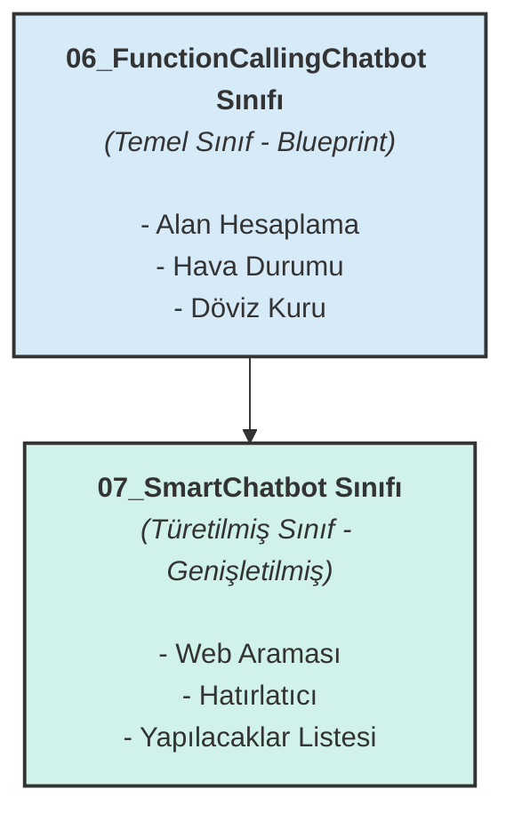

# Hafta 2: Prompt Engineering Sanatı ve OpenAI API Kullanımı


## 🎯 Haftanın Özeti

İlk hafta LLM'lerin "ne olduğunu" anladıktan sonra, bu hafta onların **"neler yapabileceğini"** keşfetmeye odaklandık. Bu modül, bir fikri çalışan bir prototipe dönüştürme yolculuğudur. İki temel yetkinlik kazandık:

1.  **Etkili İletişim Sanatı (Prompt Engineering):** Bir LLM ile nasıl "aynı dili konuşacağımızı" öğrendik. `Zero-shot` ile hızlı komutlardan, `Chain of Thought` ile karmaşık problem çözümüne kadar, modele niyetimizi en net şekilde aktarmanın stratejilerini inceledik.
2.  **LLM'lere Güç Kazandırmak (Function Calling):** Haftanın dönüm noktası olan bu konseptle, LLM'leri teorik bilgi bankaları olmaktan çıkarıp onlara **gerçek dünya ile etkileşime geçme yeteneği** kazandırdık. Artık bizim için hesaplama yapabilir, internetten veri çekebilir ve harici sistemleri tetikleyebilirler.

> Bu hafta, LLM'leri pasif metin üreticilerinden, problem çözen **proaktif ajanlara** dönüştürmenin kapısını araladık. Haftanın projesi olan **"Akıllı Kampüs Asistanı"** da bu dönüşümün somut bir kanıtıdır.

---

## 📍 İçindekiler
* [⚙️ Kurulum ve Hazırlık](#️-kurulum-ve-hazırlık)
* [📚 Modüller ve Öğrenme Yolculuğu](#-modüller-ve-öğrenme-yolculuğu)
* [🏆 Haftanın Projesi: Akıllı Kampüs Asistanı](#-haftanın-projesi-akıllı-kampüs-asistanı)
* [⭐ Haftanın Ana Konsepti: Genişletilebilir Chatbot Mimarisi](#-haftanın-ana-konsepti-kalıtım-inheritance-ile-genişletilebilir-chatbot-mimarisi)
* [🚀 Çalıştırma Talimatları](#-çalıştırma-talimatları)
* [💡 En İyi Pratikler ve Önemli Notlar](#-en-İyi-pratikler-ve-önemli-notlar)
* [➡️ Sonraki Adım: Hafta 3](#️-sonraki-adım-hafta-3)

---

## ⚙️ Kurulum ve Hazırlık

Uygulamaları çalıştırmadan önce aşağıdaki adımları tamamlayın.

**1. Sanal Ortamı Aktifleştirin:**
Proje klasöründe terminali açın ve işletim sisteminize uygun komutu çalıştırın.

```bash
# macOS / Linux için
source prompt/bin/activate

# Windows için
prompt\Scripts\activate
```

**2. Gerekli Kütüphaneleri Yükleyin:**
Tüm bağımlılıkları `requirements.txt` dosyasından yükleyin.

```bash
pip install -r requirements.txt
```

**3. OpenAI API Anahtarınızı Tanımlayın:**
Bu klasörde `.env` adında bir dosya oluşturun ve içine OpenAI'den aldığınız API anahtarınızı ekleyin.

```
OPENAI_API_KEY=sk-XXXXXXXXXXXXXXXXXXXXXXXXXXXXXX
```

---

## 📚 Modüller ve Öğrenme Yolculuğu

Bu haftanın modülleri, temelden karmaşığa doğru, birbiri üzerine inşa edilen bir yapı sunar.

| Dosya Adı | Odak Noktası | Anahtar Kavramlar ve Stratejik Değeri |
| :--- | :--- | :--- |
| **01-04_prompt...** | **Prompt Mühendisliği Temelleri** | Bir LLM'in potansiyelini tam olarak ortaya çıkarmak için ona doğru soruları sorma sanatı. Bu dosyalar, farklı görevler için en uygun iletişim stratejisini seçme yeteneği kazandırır. |
| **05_chatcompletion_api.py** | **API'ye Hakimiyet** | OpenAI API'sinin parametrelerini (örn: `temperature`) ustaca kullanarak modelden yaratıcı, tutarlı veya çeşitli çıktılar almanın teknik altyapısı. |
| **06_function_calling.py** | **Function Calling: "Merhaba Dünya"** | Haftanın en önemli konseptine giriş. LLM'e ilk kez "düşün" demek yerine "yap" demeyi öğrettiğimiz, ona harici bir araç (Python fonksiyonu) vererek yeteneklerini genişlettiğimiz an. |
| **07_chatbot_with_functions.py** | **Ölçeklenebilir Mimari (Kalıtım)** | Gerçek dünya projelerinin temelini atan bir yazılım prensibi. Mevcut bir sistemi (chatbot) bozmadan, üzerine yeni yetenekler (web arama, hatırlatıcı) ekleyerek onu nasıl büyüteceğimizi gösterir. |
| **08_simple_chatbot.py**| **Konseptin Sadeleştirilmesi**| Karmaşık mimarilerin arkasındaki temel mantığı anlamak için soyutlanmış, basit bir uygulama. "Bir LLM bir aracı nasıl seçer ve kullanır?" sorusunun en net cevabı. |
| **09_web_chatbot.py**| **Prototipi Ürüne Dönüştürme**| Kodun terminal ekranından çıkıp son kullanıcının etkileşime geçebileceği bir arayüze (web sitesi) taşınması. Fikirlerin hayata geçtiği en heyecan verici aşama. |

---

## 🏆 Haftanın Projesi: Akıllı Kampüs Asistanı

Bu proje, 2. hafta boyunca öğrenilen tüm teorik bilgilerin ve teknik becerilerin birleştiği, **uçtan uca bir LLM uygulamasının** somut bir prototipidir.

**`weekly_assignment/`** klasörü altında yer alan bu asistan, üniversite öğrencilerinin karmaşık ve dağınık kampüs hayatını basitleştirmeyi hedefleyen akıllı bir çözümdür. Sadece soruları yanıtlayan bir chatbot değil, aynı zamanda öğrencinin adına işlemler yapabilen proaktif bir yardımcıdır.

### Projenin Vizyonu ve Yetenekleri

Bu asistan, LLM'in doğal dil anlama gücünü, `Function Calling` ile kazandığı özel yeteneklerle birleştirir:

* **📅 Akademik Takvim Uzmanı:** "Vize haftası ne zaman?" veya "Ders ekleme bırakma için son gün hangi tarih?" gibi sorulara anında, net cevaplar verir.
* **📚 Ders Programı Yöneticisi:** Öğrencinin ders programını anlar ve "Bugün hangi derslerim var?" veya "Yarın ilk dersim saat kaçta?" gibi soruları yanıtlar.
* **🎉 Etkinlik ve Duyuru Takibi:** Kampüsteki konser, seminer veya spor etkinlikleri hakkında bilgi verir, hiçbir sosyal aktiviteyi kaçırmamanızı sağlar.
* **🧭 Kampüs Navigasyonu:** "Kütüphane nerede?" veya "Mühendislik fakültesine en kısa yol hangisi?" gibi sorular için yönlendirme yapar.

### Teknik Mimari

Proje, modüler ve anlaşılır bir yapıda 3 ana dosyadan oluşur:
1.  **`main.py`:** Uygulamanın beyni. Kullanıcı girdilerini alır, konuşma geçmişini yönetir ve LLM ile iletişimi kurarak hangi aracın kullanılacağına karar verir.
2.  **`tools.py`:** Asistanın "alet çantası". Akademik takvimi sorgulama, ders programını getirme gibi tüm özel yetenekler (fonksiyonlar) burada tanımlanmıştır.
3.  **`config.py`:** Projenin ayar dosyası. API anahtarları, prompt şablonları gibi yapılandırma verilerini merkezi bir yerden yönetir.

Bu proje, bir LLM'in nasıl belirli bir alanda (kampüs yönetimi) uzmanlaştırılabileceğini ve gerçek dünya problemlerine pratik çözümler sunabileceğini kanıtlamaktadır.

---

## ⭐ Haftanın Ana Konsepti: Kalıtım (Inheritance) ile Genişletilebilir Chatbot Mimarisi

Bu haftanın en önemli yazılım mühendisliği dersi, `06_function_calling.py` ve `07_chatbot_with_functions.py` arasındaki ilişkidir. Bu ilişki, **nesne yönelimli programlamanın (OOP)** gücünü ve kodun yeniden kullanılabilirliğini gösterir.



Bu yapı bize şunu öğretir: Sağlam bir temel (Temel Sınıf) oluşturduktan sonra, bu temeli bozmadan üzerine sonsuz sayıda yeni özellik (Türetilmiş Sınıf) ekleyebiliriz. Tıpkı bir arabanın standart modeline yeni donanımlar (navigasyon, sunroof) eklemek gibi.

---

## 🚀 Çalıştırma Talimatları

Her bir modülü test etmek için terminalde aşağıdaki komutları çalıştırabilirsiniz.

```bash
# Prompt Engineering Teknikleri
python 01_zero_shot.py
python 02_few_shot.py
python 03_chain_of_thought.py
python 04_role_based.py

# OpenAI API ve Function Calling
python 05_chatcompletion_api.py
python 06_function_calling.py
python 07_chatbot_with_functions.py
python 08_simple_chatbot.py

# Web Arayüzlü Chatbot
python 09_web_chatbot.py
```
> **Not:** `09_web_chatbot.py` komutunu çalıştırdıktan sonra web tarayıcınızdan `http://127.0.0.1:5000` adresine gidin.

---

## 💡 En İyi Pratikler ve Önemli Notlar

* **🔑 API Güvenliği:** API anahtarınızı asla kodun içine doğrudan yazmayın veya herkese açık repolarda paylaşmayın. Her zaman `.env` dosyası ve `python-dotenv` kütüphanesi gibi yöntemler kullanın.
* **💸 Token ve Maliyet Yönetimi:** Yaptığınız her API çağrısının bir maliyeti vardır. Özellikle GPT-4 gibi gelişmiş modelleri kullanırken token tüketiminizi OpenAI panelinden düzenli olarak takip edin.
* **🚦 API Limitleri:** OpenAI, belirli bir zaman diliminde yapabileceğiniz istek sayısını sınırlar (rate limiting). Kodunuzda bu limitleri aşmamak için gerekli beklemeleri veya hata yönetimini ekleyin.
* **🧩 Kodun Yeniden Kullanılabilirliği:** `07_chatbot_with_functions.py` dosyasında gösterildiği gibi, `inheritance` (kalıtım) kullanarak kod tekrarından kaçının ve daha modüler sistemler tasarlayın.
* **📄 Fonksiyon Tanımları:** `Function Calling` kullanırken, fonksiyonlarınızın ve parametrelerinin açıklamalarını OpenAI'nin istediği JSON formatına uygun ve net bir şekilde yapın. Modelin hangi fonksiyonu ne zaman çağıracağını anlaması bu açıklamalara bağlıdır.

---

## ➡️ Sonraki Adım: Hafta 3

Artık OpenAI API'si ile etkili bir şekilde iletişim kurabiliyor ve LLM'lere harici araçları kullanma gücü verebiliyoruz. Peki, ya kendi modellerimizi daha yakından tanımak ve yönetmek istersek?

**Hafta 3**'te, açık kaynaklı modellerin evi olan **Hugging Face Transformers** ekosistemine derinlemesine bir dalış yapacağız.
