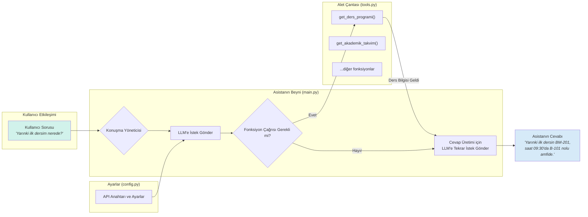

# 🏆 Proje: Akıllı Kampüs Asistanı


---

## 📍 1. Proje Özeti ve Vizyonu

**Akıllı Kampüs Asistanı**, üniversite öğrencilerinin akademik ve sosyal hayatlarını kolaylaştırmak amacıyla geliştirilmiş, yapay zeka tabanlı bir diyalog ajanıdır. Bu proje, öğrencilerin ihtiyaç duyduğu dağınık bilgilere (ders programları, akademik takvim, etkinlikler vb.) tek bir noktadan, doğal dil ile anında erişim sağlamasını hedefler.

**Vizyonumuz,** her öğrencinin kişisel bir kampüs asistanına sahip olduğu, bilgiye erişimin zahmetsizleştiği ve kampüs hayatının daha verimli ve bağlantılı hale geldiği bir gelecek yaratmaktır. Bu prototip, bu vizyona giden yolda atılmış ilk ve en önemli adımdır.

---

## 🎯 2. Problem Tanımı

Modern bir üniversite kampüsü, öğrenciler için sonsuz fırsatlar sunarken aynı zamanda ciddi bir bilgi karmaşası yaratır:
* **Dağınık Bilgi Kaynakları:** Ders programları öğrenci bilgi sisteminde (ÖBS), önemli tarihler üniversite web sitesindeki PDF'lerde, sosyal etkinlikler ise farklı kulüp sayfalarında veya sosyal medyada yer alır.
* **Zaman Kaybı:** Bir öğrencinin basit bir bilgiye ("Finaller ne zaman başlıyor?") ulaşması, birden fazla siteyi ziyaret etmesini ve uzun dokümanları taramasını gerektirebilir.
* **Anlık İhtiyaçlar:** Öğrencilerin anlık soruları ("Bir sonraki dersim hangi amfide?") veya ihtiyaçları ("Kütüphaneye nasıl giderim?") için hızlı ve pratik bir çözüm mevcut değildir.

Akıllı Kampüs Asistanı, bu dağınık yapıyı birleştirerek öğrenci için **tek ve güvenilir bir bilgi merkezi** olmayı amaçlar.

---

## ✨ 3. Temel Özellikler ve Yetenekler

Bu prototip, OpenAI'nin `Function Calling` yeteneğini kullanarak aşağıdaki işlemleri gerçekleştirebilir:

* **📅 Akademik Takvim Sorgulama:**
    * "Bu dönemki vize haftası ne zaman?"
    * "Ders bırakma için son gün hangi tarih?"
    * "Bahar tatili ne zaman başlıyor?"
    * Gelecekteki tüm önemli akademik tarihlere anında erişim sağlar.

* **📚 Kişisel Ders Programı Yönetimi:**
    * "Bugün hangi derslerim var ve saat kaçta?"
    * "Yarınki ilk dersim nerede?"
    * "Çarşamba günü programım boş mu?"
    * Öğrencinin kişisel programını anlayarak günlük planlamasına yardımcı olur.

* **🎉 Kampüs Etkinlikleri ve Duyuruları:**
    * "Bu hafta kampüste hangi konserler var?"
    * "Yapay zeka üzerine bir seminer düzenleniyor mu?"
    * Öğrencilerin sosyal hayata daha aktif katılımını teşvik eder.

* **🧭 Kampüs İçi Navigasyon ve Bilgi:**
    * "Bilgisayar mühendisliği bölüm binası nerede?"
    * "Kütüphanenin çalışma saatleri nedir?"
    * Öğrencilere kampüs içindeki önemli noktalar hakkında bilgi sağlar.

---

## 🛠️ 4. Kullanılan Teknolojiler ve Kütüphaneler

* **Programlama Dili:** `Python 3.10+`
* **Yapay Zeka Modeli:** `OpenAI API (GPT-3.5-Turbo / GPT-4)`
* **LLM ile Etkileşim:** `openai` Python Kütüphanesi
* **API Anahtar Yönetimi:** `python-dotenv`
* **Gerekli Kütüphaneler:** Projenin çalışması için gereken tüm paketler `requirements.txt` dosyasında listelenmiştir.

---

## 🏗️ 5. Teknik Mimari ve Dosya Yapısı

Proje, sürdürülebilir ve modüler bir mimari anlayışıyla üç ana bileşenden oluşmaktadır. Bu yapı, gelecekte yeni özellikler eklemeyi kolaylaştırır.



* **`main.py` - Orkestratör (Orchestrator):**
    * Uygulamanın ana giriş noktasıdır ve beyni olarak çalışır.
    * Kullanıcıdan gelen girdileri alır ve konuşma geçmişini (memory) yönetir.
    * Hangi aracın (fonksiyonun) ne zaman kullanılacağına karar vermesi için LLM ile iletişim kurar.
    * Araçlardan gelen sonuçları nihai bir cevap oluşturması için tekrar LLM'e gönderir.

* **`tools.py` - Alet Çantası (Toolbox):**
    * Asistanın sahip olduğu tüm özel yetenekler (fonksiyonlar) burada tanımlanır.
    * Her fonksiyon, tek bir atomik görevi yerine getirmek üzere tasarlanmıştır (örn: ders programını getirme, takvimi sorgulama).
    * Bu modüler yapı, yeni yeteneklerin sisteme kolayca entegre edilmesini sağlar.

* **`config.py` - Kontrol Paneli (Control Panel):**
    * API anahtarları, model isimleri, sistem rolleri için başlangıç prompt'ları gibi hassas ve yapılandırma verilerini içerir.
    * Kodun içerisinden konfigürasyon verilerini ayırarak daha temiz ve güvenli bir yapı oluşturur.
```

* **`main.py` - Orkestratör (Orchestrator):**
    * Uygulamanın ana giriş noktasıdır ve beyni olarak çalışır.
    * Kullanıcıdan gelen girdileri alır ve konuşma geçmişini (memory) yönetir.
    * Hangi aracın (fonksiyonun) ne zaman kullanılacağına karar vermesi için LLM ile iletişim kurar.
    * Araçlardan gelen sonuçları nihai bir cevap oluşturması için tekrar LLM'e gönderir.

* **`tools.py` - Alet Çantası (Toolbox):**
    * Asistanın sahip olduğu tüm özel yetenekler (fonksiyonlar) burada tanımlanır.
    * Her fonksiyon, tek bir atomik görevi yerine getirmek üzere tasarlanmıştır (örn: ders programını getirme, takvimi sorgulama).
    * Bu modüler yapı, yeni yeteneklerin sisteme kolayca entegre edilmesini sağlar.

* **`config.py` - Kontrol Paneli (Control Panel):**
    * API anahtarları, model isimleri, sistem rolleri için başlangıç prompt'ları gibi hassas ve yapılandırma verilerini içerir.
    * Kodun içerisinden konfigürasyon verilerini ayırarak daha temiz ve güvenli bir yapı oluşturur.

---

## ⚙️ 6. Kurulum ve Başlatma

Bu projeyi kendi yerel makinenizde çalıştırmak için aşağıdaki adımları izleyin:

**Adım 1: Projeyi Klonlayın ve Klasöre Gidin**
```bash
# Eğer henüz yapmadıysanız
git clone <repository_url>
cd hafta_2/weekly_assignment/
```

**Adım 2: Sanal Ortam Oluşturun ve Aktifleştirin**
```bash
# Sanal ortam oluşturma
python3 -m venv venv

# Aktifleştirme (macOS / Linux)
source venv/bin/activate

# Aktifleştirme (Windows)
venv\Scripts\activate
```

**Adım 3: Gerekli Kütüphaneleri Yükleyin**
```bash
pip install -r requirements.txt
```

**Adım 4: API Anahtarınızı Yapılandırın**
Bu klasörde `.env` adında yeni bir dosya oluşturun ve içine OpenAI API anahtarınızı aşağıdaki gibi ekleyin:
```
OPENAI_API_KEY="sk-XXXXXXXXXXXXXXXXXXXXXXXXXXXXXX"
```

**Adım 5: Asistanı Başlatın**
```bash
python main.py
```
Artık terminal üzerinden asistanla sohbet etmeye başlayabilirsiniz!

---

## 💬 7. Örnek Kullanım Senaryosu

Aşağıda bir öğrenci ile Akıllı Kampüs Asistanı arasındaki tipik bir diyalog yer almaktadır:

> **👤 Öğrenci:** Merhaba, bana biraz yardımcı olabilir misin?
> 
> **🤖 Asistan:** Merhaba! Elbette, ben senin Akıllı Kampüs Asistanınım. Ders programın, akademik takvim ve kampüs etkinlikleri hakkında sana nasıl yardımcı olabilirim?
> 
> **👤 Öğrenci:** Bu hafta kampüste teknolojiyle ilgili bir etkinlik var mı?
> 
> **🤖 Asistan:** (Arka planda `get_etkinlikler` fonksiyonunu çağırır...) Evet, bu Perşembe günü saat 14:00'te Mühendislik Fakültesi Konferans Salonu'nda "Yapay Zekanın Geleceği" üzerine bir seminer düzenleniyor. Katılmak ister misin?
> 
> **👤 Öğrenci:** Harika! Peki yarınki ilk dersim saat kaçta ve hangi sınıfta?
> 
> **🤖 Asistan:** (Arka planda `get_ders_programi` fonksiyonunu çağırır...) Elbette, kontrol ediyorum... Yarınki ilk dersin "Veri Yapıları ve Algoritmalar", saat 09:30'da B-204 nolu laboratuvarda.
>
> **👤 Öğrenci:** Teşekkürler!

---

## 🚀 8. Gelecek Planları ve Potansiyel Geliştirmeler

Bu prototip, heyecan verici bir başlangıç noktasıdır. Gelecekte proje aşağıdaki alanlarda geliştirilebilir:

* **Gerçek Zamanlı Entegrasyonlar:** Üniversitenin resmi Öğrenci Bilgi Sistemi (ÖBS) ve takvim API'lerine bağlanarak tamamen canlı ve kişiye özel veriler sunma.
* **Grafiksel Kullanıcı Arayüzü (GUI):** Projeyi `Streamlit` veya `Flask` kullanarak bir web uygulamasına dönüştürerek daha geniş bir kitleye ulaştırma.
* **Kişiselleştirilmiş Hafıza:** Her öğrencinin bölümü, aldığı dersler ve ilgi alanları gibi bilgileri hatırlayarak daha proaktif ve kişiselleştirilmiş öneriler sunma.
* **Proaktif Bildirimler:** Yaklaşan sınavlar, ödev teslim tarihleri veya ders başlangıç saatleri için kullanıcılara anlık bildirimler gönderme.
* **Çok Dilli Destek:** Asistanın farklı dillerde de hizmet vermesini sağlama.
