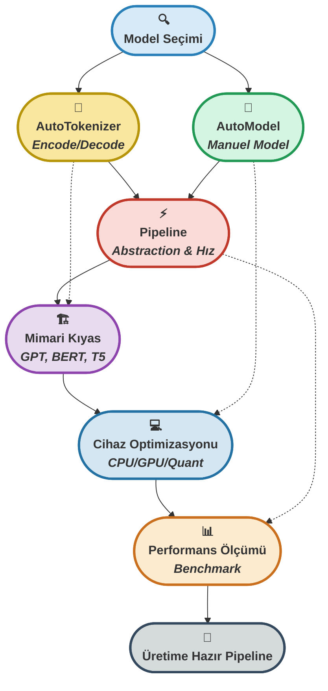

# 🧠 **Hafta 3: AutoTokenizer, AutoModel ve Pipeline Optimizasyonu**


---

## 📁 Dosya Yapısı

Bu klasördeki ana dosyalar ve içerikleri:

| Dosya Adı                        | Açıklama                                                                                   |
|-----------------------------------|-------------------------------------------------------------------------------------------|
| `01_autotokenizer_automodel.py`   | AutoTokenizer ve AutoModel ile temel encode/decode, manuel ve pipeline ile model çağırma   |
| `02_gpt_bert_t5_comparison.py`    | GPT, BERT ve T5 mimarilerinin karşılaştırılması, pipeline entegrasyonu ve analizler        |
| `03_cpu_gpu_optimization.py`      | CPU/GPU seçimi, quantization, batch processing ve bellek dostu inference teknikleri        |
| `04_performance_measurement.py`   | Pipeline ile performans ölçümü, farklı task ve batch size'larda benchmark ve raporlama     |
| `requirements.txt`                | Gerekli Python paketleri listesi                                                           |
| `README.md`                       | Haftanın özeti, kullanım talimatları, teknik açıklamalar ve ek kaynaklar                   |

Her dosya, Hugging Face Transformers ve PyTorch ekosisteminde üretim kalitesinde NLP uygulamaları geliştirmek için örnekler ve optimizasyon teknikleri içerir.

---

## 🎯 Haftanın Özeti
Bu hafta, Hugging Face Transformers kütüphanesinin temel bileşenlerini kapsamlı ve sistematik biçimde analiz ederek, **AutoTokenizer**, **AutoModel** ve **Pipeline** yapılarını ileri düzeyde değerlendirdim.  
Çalışmalarımda, performans ölçümleri, CPU/GPU optimizasyon stratejileri, quantization ve batch processing gibi modern teknikleri uygulayarak; yalnızca prototipleme değil, aynı zamanda **üretim ve araştırma ortamlarında kullanılabilecek, akademik standartlarda benchmark raporları** üretebilen, yüksek verimli ve sürdürülebilir bir NLP altyapısı inşa ettim.  
Her aşamada, model mimarisi ve donanım uyumluluğu açısından en iyi uygulamaları gözeterek, **ölçeklenebilir ve tekrarlanabilir deneysel süreçler** tasarladım.

---

## 🚦 Transformers ile Modelleme Yolculuğu

<p align="center" style="font-size:1.1em;">
  <b>🚀 Sıradan koddan üretim kalitesinde NLP'ye: <span style="color:#2980B9;">AutoTokenizer</span>, <span style="color:#229954;">AutoModel</span> ve <span style="color:#CA6F1E;">Pipeline</span> ile <span style="color:#C0392B;">benchmark</span> odaklı, <span style="color:#8E44AD;">optimize</span> bir yolculuk!<br>
  <span style="color:#F39C12;">Her adımda hız, güç ve esneklik!</span></b>
</p>



<p align="center" style="font-size:1.1em; margin-top:10px;">
  <b>✨ <span style="color:#229954;">Fikirden</span> <span style="color:#C0392B;">benchmark'a</span>, <span style="color:#CA6F1E;">optimizasyondan</span> <span style="color:#8E44AD;">üretime</span>...<br>
  <span style="color:#2980B9;">Her adımda hız, güç ve profesyonellik!</span> ✨</b>
</p>

---

## 📚 İçerik

### 1. AutoTokenizer & AutoModel Yapısı + Pipeline ile Hızlı Model Çağırma  
**Dosya:** `01_autotokenizer_automodel.py`  
- Tokenizer ile encode/decode süreçleri  
- AutoModel ile manuel model çağırma  
- Pipeline abstraction: hız ve sadelik  
- Manual vs Pipeline kıyaslamaları  
- Özelleştirilmiş pipeline örnekleri  

---

### 2. GPT, BERT ve T5 Modellerinin Farkları ve Pipeline Entegrasyonu  
**Dosya:** `02_gpt_bert_t5_comparison.py`  
- Model mimarilerinin karşılaştırması  
- Her bir mimarinin güçlü yönleri ve kullanım bağlamları  
- Pipeline entegrasyonu ile tek satırlık testler  
- Parametre sayısı, hız ve VRAM tüketimi analizleri  

| Model | Mimari | Güçlü Yönler | Kullanım Alanları |
|-------|--------|--------------|-------------------|
| **GPT** | Decoder-only | Uzun metin üretimi | Creative writing, Conversational AI |
| **BERT** | Encoder-only | Bidirectional anlama | Classification, NER, QA |
| **T5** | Encoder-decoder | Text-to-text yaklaşımı | Translation, Summarization |

---

### 3. CPU/GPU Performans Yönetimi ve Model Optimizasyonu  
**Dosya:** `03_cpu_gpu_optimization.py`  
- Optimal cihaz seçimi (cuda/mps/cpu)  
- CPU thread tuning  
- GPU bellek yönetimi (amp, autocast)  
- Model quantization (8-bit, dynamic)  
- Batch processing optimizasyonu  
- Bellek dostu inference yöntemleri  

**Kritik Teknikler:**  
- `torch.no_grad()` ile gereksiz gradient hesaplamalarını engelleme  
- `torch.cuda.empty_cache()` ve `gc.collect()` ile bellek temizliği  
- `BitsAndBytesConfig` ile quantization  
- Dynamic padding ile hızlanma  

---

### 4. Pipeline ile GPU/CPU Performansını Ölçme ve Kıyaslama  
**Dosya:** `04_performance_measurement.py`  
- PerformanceMeter sınıfı ile ölçümler  
- Farklı task’larda benchmark testleri  
- Batch size varyasyonlarının etkisi  
- Detaylı raporlar ve görselleştirme  

**Metrikler:**  
- Inference süresi  
- Memory kullanımı (CPU/GPU)  
- Throughput (texts/sec)  
- Device utilization  
- Model yükleme süresi  

---

### 📝 Manuel Kurulum

#### 1. Sanal Ortam Oluştur
```bash
# macOS/Linux
python3 -m venv llm_bootcamp_env
source llm_bootcamp_env/bin/activate

# Windows
python -m venv llm_bootcamp_env
llm_bootcamp_env\Scripts\activate.bat
```

#### 2. Bağımlılıkları Yükle
```bash
pip install --upgrade pip
pip install -r requirements.txt
```

#### 3. Modülleri Çalıştır
```bash
# AutoTokenizer ve AutoModel örnekleri
python 01_autotokenizer_automodel.py

# Model karşılaştırması
python 02_gpt_bert_t5_comparison.py

# Performans optimizasyonu
python 03_cpu_gpu_optimization.py

# Performans ölçümü
python 04_performance_measurement.py
```

## 📋 Gereksinimler

```bash
pip install transformers torch torchvision torchaudio
pip install psutil matplotlib numpy
pip install bitsandbytes  # Quantization için (opsiyonel)
```

**GPU Desteği için:**
- CUDA: `pip install torch torchvision torchaudio --index-url https://download.pytorch.org/whl/cu118`
- Apple Silicon: Otomatik olarak MPS desteği

---

## 🌟 Haftanın Aşamaları & Sıkça Sorulanlar

### 1. **AutoTokenizer & AutoModel ile Temel Kullanım**
- **Amaç:** Hugging Face modellerini hızlıca yükleyip, metinleri encode/decode etmek.
- **Kod:**
  ```python
  from transformers import AutoTokenizer, AutoModel
  tokenizer = AutoTokenizer.from_pretrained("bert-base-uncased")
  model = AutoModel.from_pretrained("bert-base-uncased")
  inputs = tokenizer("Transformers harika!", return_tensors="pt")
  outputs = model(**inputs)
  ```
- <div style="border:1px solid #2980B9; border-radius:8px; padding:12px; background:#F4F8FB; margin:10px 0;">
  <b>Soru:</b> AutoTokenizer ve AutoModel neden tercih edilir?<br>
  <b>Cevap:</b> Model ve tokenizer'ı otomatik olarak doğru konfigürasyonla yükler, kod tekrarını ve hata riskini azaltır.
  </div>

---

### 2. **Pipeline ile Hızlı Model Çağırma**
- **Amaç:** Tek satırda inference, task abstraction ve hız.
- **Kod:**
  ```python
  from transformers import pipeline
  nlp = pipeline("sentiment-analysis", model="distilbert-base-uncased")
  print(nlp("Transformers çok güçlü!"))
  ```
- <div style="border:1px solid #229954; border-radius:8px; padding:12px; background:#F4FBF4; margin:10px 0;">
  <b>Soru:</b> Pipeline abstraction'ın avantajı nedir?<br>
  <b>Cevap:</b> Model, tokenizer ve task logic'i tek satırda birleştirir; hızlı prototipleme ve test için idealdir.
  </div>

---

### 3. **GPT, BERT ve T5 Mimarilerinin Kıyaslanması**
- **Amaç:** Farklı transformer mimarilerinin güçlü yönlerini ve kullanım alanlarını anlamak.
- **Tablo:**

  | Model | Mimari | Güçlü Yönler | Kullanım Alanları |
  |-------|--------|--------------|-------------------|
  | **GPT** | Decoder-only | Uzun metin üretimi | Creative writing, Conversational AI |
  | **BERT** | Encoder-only | Bidirectional anlama | Classification, NER, QA |
  | **T5** | Encoder-decoder | Text-to-text yaklaşımı | Translation, Summarization |

- <div style="border:1px solid #C0392B; border-radius:8px; padding:12px; background:#FDF2F0; margin:10px 0;">
  <b>Soru:</b> Hangi mimari hangi görevde öne çıkar?<br>
  <b>Cevap:</b> GPT üretkenlikte, BERT anlamada, T5 ise çoklu görevlerde (text-to-text) üstündür.
  </div>

---

### 4. **Cihaz ve Model Optimizasyonu**
- **Amaç:** CPU/GPU seçimi, quantization ve batch processing ile inference hızını artırmak.
- **Kod:**
  ```python
  import torch
  device = torch.device("cuda" if torch.cuda.is_available() else "cpu")
  model = model.to(device)
  with torch.no_grad():
      outputs = model(**{k: v.to(device) for k, v in inputs.items()})
  ```
- <div style="border:1px solid #8E44AD; border-radius:8px; padding:12px; background:#F7F1FA; margin:10px 0;">
  <b>Soru:</b> Quantization ve batch processing neden önemlidir?<br>
  <b>Cevap:</b> Quantization ile bellek ve hız kazanılır; batch processing ile throughput artar.
  </div>

---

### 5. **Performans Ölçümü & Benchmarking**
- **Amaç:** Inference süresi, memory kullanımı ve throughput gibi metriklerle model performansını ölçmek.
- **Kod:**
  ```python
  import time
  start = time.time()
  _ = nlp(["Test cümlesi"] * 32)
  print("Süre:", time.time() - start)
  ```
- <div style="border:1px solid #34495E; border-radius:8px; padding:12px; background:#F4F6F7; margin:10px 0;">
  <b>Soru:</b> Hangi metrikler kritik?<br>
  <b>Cevap:</b> Inference süresi, memory kullanımı, throughput ve device utilization üretim için belirleyicidir.
  </div>

---

## 💡 En İyi Uygulamalar

### Performans Optimizasyonu
```python
# ✅ İyi
with torch.no_grad():
    outputs = model(**inputs)

# ❌ Kötü  
outputs = model(**inputs)  # Gradient hesaplanır
```

### Device Yönetimi
```python
# ✅ İyi
device = torch.device("cuda" if torch.cuda.is_available() else "cpu")
model = model.to(device)
inputs = {k: v.to(device) for k, v in inputs.items()}

# ❌ Kötü
model = model.to("cuda")  # CUDA olmayabilir
```

### Memory Yönetimi
```python
# ✅ İyi
del model
torch.cuda.empty_cache()
gc.collect()

# ❌ Kötü
# Memory leak'e sebep olabilir
```

---

<p align="center" style="font-size:1.1em;">
  <b>🌟 <span style="color:#CA6F1E;">Transformers ile optimize pipeline</span>, <span style="color:#229954;">üretim kalitesinde NLP'nin anahtarıdır!</span> 🌟</b>
</p>

<br>

<table align="center">
  <thead>
    <tr>
      <th style="background:#D6EAF8; color:#2980B9;"><b>Model</b></th>
      <th style="background:#F9E79F; color:#B7950B;"><b>Device</b></th>
      <th style="background:#D5F5E3; color:#229954;"><b>Inference Time</b></th>
      <th style="background:#FADBD8; color:#C0392B;"><b>Memory Usage</b></th>
    </tr>
  </thead>
  <tbody>
    <tr>
      <td><b>DistilBERT</b></td>
      <td>CPU</td>
      <td><span style="color:#229954;"><b>0.045s</b></span></td>
      <td>1.2 GB</td>
    </tr>
    <tr>
      <td><b>DistilBERT</b></td>
      <td><b style="color:#2980B9;">GPU</b></td>
      <td><span style="color:#229954;"><b>0.012s</b></span></td>
      <td>2.1 GB</td>
    </tr>
    <tr>
      <td><b>BERT-base</b></td>
      <td>CPU</td>
      <td><span style="color:#229954;"><b>0.089s</b></span></td>
      <td>2.1 GB</td>
    </tr>
    <tr>
      <td><b>BERT-base</b></td>
      <td><b style="color:#2980B9;">GPU</b></td>
      <td><span style="color:#229954;"><b>0.021s</b></span></td>
      <td>3.2 GB</td>
    </tr>
  </tbody>
</table>

---

## 📚 Ek Kaynaklar

> Akademik altyapımı güçlendirmek için haftanın sonunda başvurduğum **önemli referanslar**:  

<details>
<summary>📘 Hugging Face Transformers Documentation</summary>
<a href="https://huggingface.co/docs/transformers/" target="_blank">https://huggingface.co/docs/transformers/</a>  
🔎 Modellerin, tokenizer’ların ve pipeline mimarisinin resmi açıklamaları ve ileri düzey kullanım örnekleri.  
</details>

<details>
<summary>⚡ PyTorch Performance Tuning Guide</summary>
<a href="https://pytorch.org/tutorials/recipes/recipes/tuning_guide.html" target="_blank">https://pytorch.org/tutorials/recipes/recipes/tuning_guide.html</a>  
⚙️ CPU/GPU hız optimizasyonları, bellek yönetimi ve üretim ortamı için ileri seviye teknikler.  
</details>

<details>
<summary>📑 BERT Paper (Devlin et al., 2018)</summary>
<a href="https://arxiv.org/abs/1810.04805" target="_blank">https://arxiv.org/abs/1810.04805</a>  
🧩 Bidirectional encoder mimarisinin metin anlama görevlerinde devrim yaratan orijinal makalesi.  
</details>

<details>
<summary>📝 GPT Paper (Radford et al., 2018)</summary>
<a href="https://cdn.openai.com/research-covers/language-unsupervised/language_understanding_paper.pdf" target="_blank">https://cdn.openai.com/research-covers/language-unsupervised/language_understanding_paper.pdf</a>  
✒️ Unsupervised pretraining yaklaşımının ilk kez tanımlandığı, generative transformer ailesinin başlangıç noktası.  
</details>

<details>
<summary>🔄 T5 Paper (Raffel et al., 2019)</summary>
<a href="https://arxiv.org/abs/1910.10683" target="_blank">https://arxiv.org/abs/1910.10683</a>  
🌐 “Text-to-Text Transfer Transformer” paradigmasını sunan, tüm NLP görevlerini ortak bir formata indirgeyen çalışma.  
</details>

