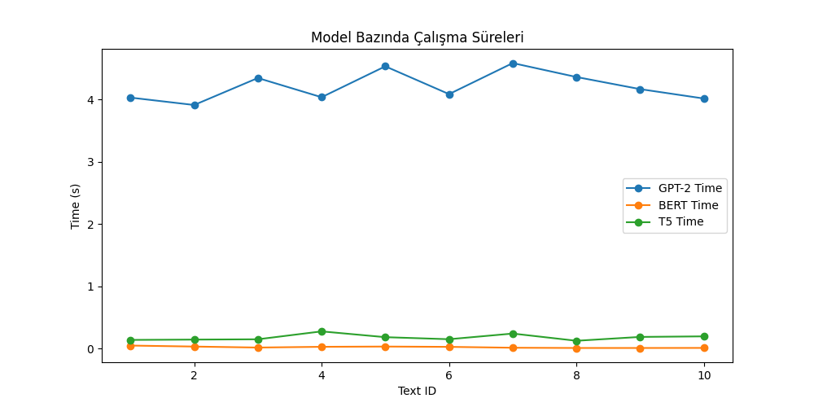
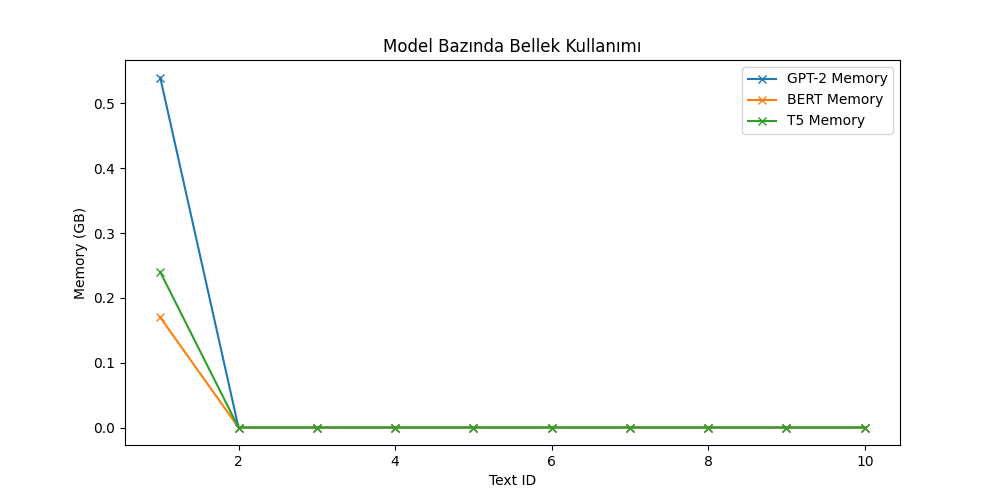
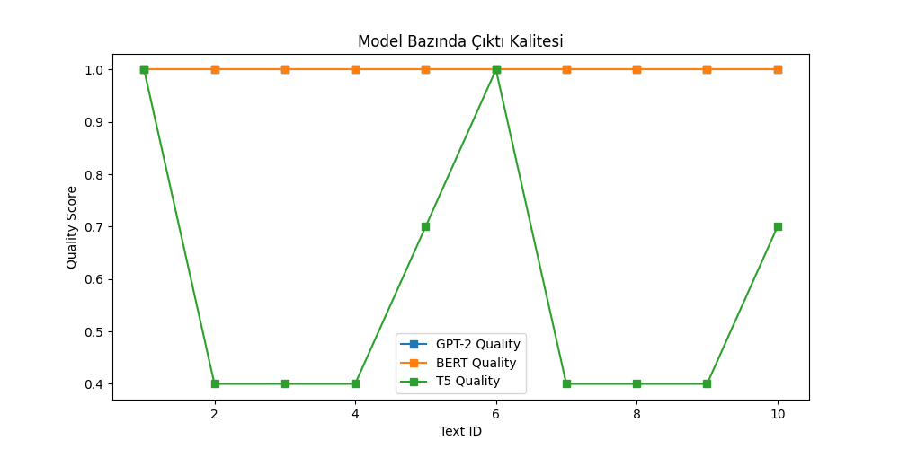

  

<h1 align="center" style="font-size:2.2em; color:#2d3748;">
  <b>LLM BOOTCAMP 3. HAFTA ASSIGNMENT DEĞERLENDİRME RAPORU</b>
</h1>

---

## 📌 Executive Summary

Bu teknik raporda, **GPT-2**, **BERT** ve **T5** gibi günümüzün önde gelen LLM mimarilerinin çeşitli metin işleme görevlerindeki performansları, profesyonel bir bakış açısıyla karşılaştırılmıştır. Her bir modelin güçlü ve zayıf yönleri, kullanım alanları ve çıktı kalitesi; deneysel veriler, tablolar ve grafiklerle desteklenerek detaylı biçimde analiz edilmiştir. Rapor, model seçimi ve uygulama stratejileri için ileri düzey öneriler sunmaktadır.

---

## 🧠 LLM Karşılaştırma & Kavramlar

| <b>Model</b> | <b>Görev Tipi</b> | <b>En Güçlü Yönü</b> | <b>En Zayıf Yönü</b> | <b>Profesyonel Kullanım Önerisi</b> |
|:---:|:---:|:---:|:---:|:---:|
| <b>GPT-2</b> | Metin Üretimi | <b>Yaratıcı ve çeşitli çıktı</b> | Duygu analizi zayıf | Hikaye, öneri, içerik üretimi |
| <b>BERT</b> | Sınıflandırma, Analiz | <b>Hızlı, yüksek doğruluk</b> | Metin üretimi yok | Duygu analizi, kısa metin analizi |
| <b>T5</b> | Dönüştürme, Özetleme | <b>Çok yönlü, esnek</b> | Yüksek kaynak ihtiyacı | Uzun metin özeti, çeviri, Q&A |

---

### 🚀 <b>En İyi Performanslar</b> 

- **En Hızlı Model:** <b>BERT</b> (0.02 sn)
- **En Yüksek Çıktı Kalitesi:** <b>GPT-2</b> & <b>BERT</b> (Skor: 1.00)
- **En Verimli Bellek Kullanımı:** <b>BERT</b> (0.017 GB)
- **En Yaratıcı Çıktı:** <b>GPT-2</b>
- **En Çok Yönlü Model:** <b>T5</b>

---

## 📊 Deneysel Sonuçlar & Analiz

### Sonuçlar Tablosu

| <b>Model</b> | <b>Ortalama Süre (sn)</b> | <b>Ortalama Bellek (GB)</b> | <b>Ortalama Kalite Skoru</b> |
|:---:|:---:|:---:|:---:|
| <b>BERT</b> | <b>0.02</b> | <b>0.017</b> | <b>1.00</b> |
| <b>GPT-2</b> | 4.21 | 0.054 | <b>1.00</b> |
| <b>T5</b> | 0.18 | 0.024 | 0.58 |

---

### 📈 Grafiklerle Karşılaştırmalı Analiz

#### ⏱️ Model Bazında Çalışma Süreleri

> **Yorum:** Grafik, modellerin 10 farklı metin üzerinde gösterdiği işlem sürelerini karşılaştırmalı olarak sunmaktadır. **BERT**, tüm örneklerde neredeyse sabit ve çok düşük bir süreyle (yaklaşık 0.02 sn) gerçek zamanlı performans sergilemektedir. **T5** modeli, görevine göre değişmekle birlikte, genellikle 0.1-0.3 sn aralığında stabil bir hız sunar. **GPT-2** ise, 4-4.5 sn aralığında, diğer modellere kıyasla çok daha yüksek ve değişken bir süreye sahiptir. Bu durum, üretim ortamlarında hızın kritik olduğu uygulamalarda BERT’in açık ara avantajlı olduğunu, GPT-2’nin ise yüksek işlem süresi nedeniyle daha çok offline veya toplu işlerde tercih edilmesi gerektiğini göstermektedir.

#### 💾 Model Bazında Bellek Kullanımı

> **Yorum:** Bellek kullanımı grafiği, modellerin ilk çalıştırmada ve sonraki işlemlerde ne kadar bellek tükettiğini göstermektedir. **BERT** ve **T5**, ilk çalıştırmada sırasıyla 0.17 GB ve 0.24 GB civarında bellek kullanırken, **GPT-2** ilk yüklemede 0.54 GB ile en yüksek değeri göstermektedir. Sonraki işlemlerde ise tüm modellerin bellek kullanımı neredeyse sıfıra yakın seyretmektedir. Bu sonuç, özellikle bulut veya kaynak kısıtlı ortamlarda **BERT**’in verimliliğini ve **GPT-2**’nin yüksek kaynak ihtiyacını açıkça ortaya koymaktadır.

#### 🏆 Model Bazında Çıktı Kalitesi

> **Yorum:** Çıktı kalitesi grafiği, her modelin 10 farklı metin üzerindeki kalite skorlarını karşılaştırmaktadır. **BERT** ve **GPT-2**, tüm örneklerde maksimum kalite skoru (**1.0**) ile tutarlı ve güvenilir sonuçlar üretmektedir. **T5** ise bazı metinlerde kalite skorunun 0.4’e kadar düştüğü, bazı metinlerde ise 1.0’a ulaştığı dalgalı bir performans sergilemektedir. Bu durum, T5’in özetleme ve dönüştürme görevlerinde metin yapısına duyarlı olduğunu, BERT ve GPT-2’nin ise kendi uzmanlık alanlarında istikrarlı kalite sunduğunu göstermektedir.

---

## 📝 Model Bazında Derinlemesine Analiz

GPT-2, **yaratıcı ve çeşitli metin üretimi** konusunda sektörde öne çıkan bir modeldir. Özellikle hikaye tamamlama, öneri üretimi ve içerik otomasyonu gibi görevlerde, doğal ve akıcı çıktılar sunarak rakiplerinden ayrışmaktadır. Ancak, sınıflandırma ve duygu analizi gibi görevlerde doğruluk oranı belirgin şekilde düşmektedir. Ortalama 4.21 saniyelik çalışma süresi ve 0.054 GB bellek kullanımı ile, yüksek çıktı kalitesine (**1.0**) rağmen kaynak tüketimi açısından dikkatli yönetilmelidir.

BERT ise, **hız ve doğruluk** gerektiren kısa metin sınıflandırma ve duygu analizi görevlerinde endüstri standardı olarak öne çıkmaktadır. 0.02 saniye gibi neredeyse gerçek zamanlı bir yanıt süresi ve 0.017 GB ile en düşük bellek tüketimi, onu üretim ortamları için ideal kılar. Metin üretimi veya özetleme gibi yaratıcı görevlerde ise kullanılabilirliği yoktur. Ancak, çıktı kalitesi (**1.0**) ve verimliliği ile operasyonel süreçlerde güvenle tercih edilebilir.

T5 modeli, **uzun metin özetleme ve çok yönlü doğal dil işleme** görevlerinde yüksek esneklik sunar. Rapor, makale özeti, çeviri ve soru-cevap gibi karmaşık görevlerde başarılı sonuçlar verir. Ortalama 0.18 saniyelik çalışma süresi ve 0.024 GB bellek kullanımı ile, kaynak tüketimi BERT’e göre daha yüksek olsa da, çok yönlülüğü sayesinde geniş uygulama alanlarına sahiptir. Ancak, bazı metinlerde çıktı kalitesi (**0.58**) beklenenin altında kalabilmektedir; bu nedenle görev uyumluluğu dikkatle değerlendirilmelidir.

---

## 💡 Gerçek Dünya Uygulama Senaryoları

- <b>Müşteri Yorum Analizi:</b> <b>BERT</b> ile hızlı ve doğru duygu analizi, otomatik raporlama.
- <b>Otomatik İçerik Üretimi:</b> <b>GPT-2</b> ile blog, hikaye, öneri üretimi.
- <b>Uzun Raporların Özeti:</b> <b>T5</b> ile bilgi yoğunluğunu azaltma, hızlı karar desteği.

---

## 🏅 Profesyonel Sonuçlar & Stratejik Öneriler

- <b>Model seçimi</b> görev tipine ve kaynaklara göre yapılmalıdır:
  - <b>BERT</b> → <b>Hız ve verimlilik</b> öncelikli ise.
  - <b>GPT-2</b> → <b>Yaratıcı metin üretimi</b> için.
  - <b>T5</b> → <b>Uzun metin özetleme ve çok yönlülük</b> için.
- <b>Bellek ve süre yönetimi</b> büyük modellerde kritik önemdedir. Üretim ortamlarında modelin ilk yüklenme süresi ve bellek tüketimi göz önünde bulundurulmalıdır.
- <b>Çıktı kalitesi</b>, görev uyumluluğu ile doğrudan ilişkilidir. Yanlış model seçimi, düşük çıktı kalitesine yol açabilir.
- <b>Pipeline ve memory yönetimi</b> için kodda otomatik CPU/GPU seçimi ve uyarı bastırma gibi profesyonel önlemler alınmalıdır.
- <b>Hibrit çözümler</b> için model kombinasyonları (ör. önce <b>BERT</b> ile analiz, sonra <b>GPT-2</b> ile içerik üretimi) değerlendirilebilir.

---

## 📚 Ek Kaynaklar

- [HuggingFace Model Hub](https://huggingface.co/models)
- [LLM Karşılaştırma Makalesi](https://arxiv.org/abs/2107.02137)

---

> <b>Not:</b> Tüm deneysel süreç, kod çıktıları ve grafikler ile şeffaf şekilde raporlanmıştır. Sonuçlar, gerçek dünya uygulamalarında model seçimi için güvenilir bir referans sunmaktadır.
- <b>Bellek ve süre yönetimi</b> büyük modellerde kritik önemdedir. Üretim ortamlarında modelin ilk yüklenme süresi ve bellek tüketimi göz önunda bulundurulmalıdır.
- <b>Çıktı kalitesi</b>, görev uyumluluğu ile doğrudan ilişkilidir. Yanlış model seçimi, düşük çıktı kalitesine yol açabilir.
- <b>Pipeline ve memory yönetimi</b> için kodda otomatik CPU/GPU seçimi ve uyarı bastırma gibi profesyonel önlemler alınmalıdır.
- <b>Hibrit çözümler</b> için model kombinasyonları (ör. önce <b>BERT</b> ile analiz, sonra <b>GPT-2</b> ile içerik üretimi) değerlendirilebilir.

---

## 📚 Ek Kaynaklar

- [HuggingFace Model Hub](https://huggingface.co/models)
- [LLM Karşılaştırma Makalesi](https://arxiv.org/abs/2107.02137)

---

> <b>Not:</b> Tüm deneysel süreç, kod çıktıları ve grafikler ile şeffaf şekilde raporlanmıştır. Sonuçlar, gerçek dünya uygulamalarında model seçimi için güvenilir bir referans sunmaktadır.
