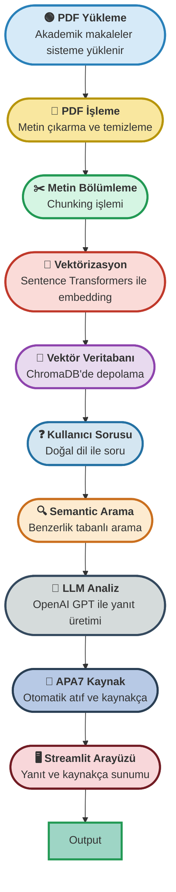

# 📚 **Akademik Makale Asistanı: AI Destekli Araştırma Platformu**


---

## 📈 Akış Diyagramı: Akademik Makale Analiz Süreci



---

## 📁 Dosya Yapısı

| Dosya/Klasör Adı           | Açıklama                                                                 |
|----------------------------|--------------------------------------------------------------------------|
| `app.py`                   | Ana Streamlit uygulaması: Kullanıcı arayüzü ve backend entegrasyonu     |
| `requirements.txt`         | Proje bağımlılıkları ve kütüphane listesi                               |
| `README.md`                | Proje dokümantasyonu ve kullanım kılavuzu                               |
| `src/`                     | **Kaynak kod modülleri**                                                 |
| `├── pdf_manager.py`       | PDF yükleme, metin çıkarma ve dosya yönetimi                            |
| `├── vector_db.py`         | ChromaDB vektör veritabanı işlemleri ve embedding                       |
| `├── llm_handler.py`       | OpenAI API entegrasyonu ve prompt yönetimi                              |
| `├── citation_manager.py`  | APA7 formatında atıf ve kaynakça oluşturma                              |
| `├── article_analyzer.py`  | Makale analizi ve özet çıkarma modülü                                   |
| `pdfs/`                    | Yüklenen akademik makalelerin depolandığı klasör                        |
| `data/`                    | ChromaDB vektör veritabanı ve metadata dosyaları                        |

---

## 🚀 Proje Özeti

**Akademik Makale Asistanı**, araştırmacıların PDF formatındaki akademik makaleleri yükleyerek, bu makaleler üzerinde doğal dil ile sorular sorabildiği ve AI destekli yanıtlar aldığı gelişmiş bir RAG (Retrieval-Augmented Generation) platformudur.

Platform, yüklenen makaleleri otomatik olarak işleyerek vektör veritabanında depolar ve kullanıcının sorularına en ilgili içeriklerden hareketle, OpenAI GPT modeli ile yanıtlar üretir. Tüm yanıtlarda APA7 formatında metin içi atıf ve kaynakça otomatik olarak oluşturulur.

Sistem, özellikle akademik araştırmacılar, yüksek lisans/doktora öğrencileri ve literatür taraması yapan uzmanlar için tasarlanmıştır. Çoklu makale desteği, semantic arama ve otomatik kaynak yönetimi ile araştırma süreçlerini önemli ölçüde hızlandırır.

---

## 🎨 Temel Özellikler ve Modüller

### 📚 Kütüphane Yönetimi
- **PDF Yükleme**: Drag & drop ile kolay makale yükleme
- **Dosya Yönetimi**: Yüklenen makaleleri görüntüleme ve silme
- **Otomatik İşleme**: PDF'lerden metin çıkarma ve temizleme
- **Metadata Depolama**: Makale bilgilerini JSON formatında saklama

### 🔍 Akıllı Arama ve Analiz
- **Semantic Search**: Sentence Transformers ile benzerlik tabanlı arama
- **ChromaDB Entegrasyonu**: Hızlı ve ölçeklenebilir vektör veritabanı
- **Chunking Stratejisi**: Optimal boyutlarda metin bölümleme
- **Bağlamsal Analiz**: RAG mimarisi ile ilgili içerik bulma

### 🤖 AI Destekli Yanıt Üretimi
- **OpenAI GPT Entegrasyonu**: Güçlü dil modeli ile yanıt üretimi
- **Bağlamsal Prompt**: İlgili makale içerikleriyle zenginleştirilmiş promptlar
- **Makale Analizi**: Yöntem, bulgular ve sonuçları otomatik analiz
- **Özet Üretimi**: Makale özetleme ve ana noktaları çıkarma

### 📝 Otomatik Kaynak Yönetimi
- **APA7 Formatı**: Akademik standartlara uygun atıf formatı
- **Metin İçi Alıntı**: Yanıtlarda otomatik kaynak belirtme
- **Kaynakça Oluşturma**: Kullanılan makalelerin tam kaynakçası
- **Sohbet Geçmişi**: Tüm soru-cevapları ve kaynakları saklama

---

## ⚡ Kurulum ve Çalıştırma

### 1. Gereksinimler
- Python 3.8+
- OpenAI API anahtarı
- pip

### 2. Proje Kurulumu
```bash
# Projeyi klonlayın
git clone <repository-url>
cd AkademikMakaleAsistani

# Bağımlılıkları kurun
pip install -r requirements.txt
```

### 3. Ortam Değişkenlerini Ayarlayın
```bash
# .env dosyası oluşturun
echo "OPENAI_API_KEY=your_openai_api_key_here" > .env
```

### 4. Uygulamayı Başlatın
```bash
streamlit run app.py
```

### 5. Arayüze Erişim
- Tarayıcınızda `http://localhost:8501` adresini açarak uygulamayı kullanabilirsiniz.

---

## 👨‍💻 Kullanım Kılavuzu

### 📚 Makale Yükleme
1. **"Kütüphanem"** sekmesine gidin
2. PDF dosyalarınızı drag & drop ile yükleyin
3. Sistem otomatik olarak metni çıkarır ve vektörize eder
4. Yüklenen makaleler listede görünür

### ❓ Soru Sorma
1. **"Soru Sor"** sekmesine gidin
2. Akademik sorunuzu doğal dilde yazın
3. **"Yanıt Al"** butonuna tıklayın
4. AI destekli yanıt ve APA7 kaynakça alın

### 📊 Makale Analizi
1. **"Makale Analizi"** sekmesine gidin
2. Analiz etmek istediğiniz makaleyi seçin
3. Yöntem, bulgular ve sonuçların otomatik analizini görün

### 📝 Geçmiş Yönetimi
1. **"Sohbet Geçmişi"** sekmesinde tüm sorularınızı görün
2. Önceki yanıtları ve kaynakları inceleyin
3. Geçmişi TXT formatında indirin

---

## 🛠️ Teknik Özellikler

- **Streamlit Framework**: Modern ve interaktif web arayüzü
- **ChromaDB**: Yüksek performanslı vektör veritabanı
- **Sentence Transformers**: Semantic embedding ve benzerlik hesaplama
- **OpenAI GPT**: Gelişmiş doğal dil işleme ve yanıt üretimi
- **PyPDF2**: PDF metin çıkarma ve işleme
- **RAG Mimarisi**: Retrieval-Augmented Generation yaklaşımı
- **APA7 Standartları**: Akademik atıf ve kaynakça formatı

---

## 📦 Kullanılan Teknolojiler

| Kategori               | Teknolojiler                                                              |
|-----------------------|---------------------------------------------------------------------------|
| **Frontend**          | Streamlit, HTML/CSS                                                       |
| **Backend**           | Python, OpenAI API, ChromaDB                                             |
| **NLP & AI**          | Sentence Transformers, OpenAI GPT, RAG                                   |
| **Veritabanı**        | ChromaDB (Vektör), JSON (Metadata)                                       |
| **PDF İşleme**        | PyPDF2, python-dotenv                                                    |
| **Deployment**        | Local Streamlit Server                                                   |

---

## 💡 Neden Akademik Makale Asistanı?

- **Zaman Tasarrufu**: Çoklu makale arasında hızlı arama ve analiz
- **Otomatik Kaynak**: APA7 formatında perfect atıf ve kaynakça
- **AI Destekli**: OpenAI GPT ile yüksek kaliteli akademik yanıtlar
- **Kullanıcı Dostu**: Sade ve etkili Streamlit arayüzü
- **Semantic Arama**: İlgili içerikleri hassas şekilde bulma
- **Geçmiş Yönetimi**: Tüm araştırma sürecini kaydetme ve takip etme
- **Ölçeklenebilir**: Yüzlerce makale ile çalışabilme kapasitesi

---

## 🔧 Gelişmiş Özellikler

### 🎯 Semantic Search
- **Çoklu Embedding**: Farklı transformer modelleri desteği
- **Benzerlik Eşiği**: Ayarlanabilir relevance skoru
- **Chunking Optimizasyonu**: Optimal metin bölümleme stratejileri

### 📊 Analytics & Insights  
- **Makale İstatistikleri**: Kullanım ve erişim analitiği
- **Soru Trendleri**: En çok sorulan konu alanları
- **Kaynak Analizi**: En çok referans verilen makaleler

### 🔒 Güvenlik & Privacy
- **Local Processing**: Veriler yerel ortamda işlenir
- **API Güvenliği**: Secure OpenAI API entegrasyonu
- **Dosya Güvenliği**: PDF dosyalarının güvenli depolanması

---

## 📚 Ek Kaynaklar

<details>
<summary>OpenAI API Documentation</summary>
<a href="https://platform.openai.com/docs/" target="_blank">https://platform.openai.com/docs/</a>
</details>

<details>
<summary>ChromaDB Documentation</summary>
<a href="https://docs.trychroma.com/" target="_blank">https://docs.trychroma.com/</a>
</details>

<details>
<summary>Streamlit Documentation</summary>
<a href="https://docs.streamlit.io/" target="_blank">https://docs.streamlit.io/</a>
</details>

<details>
<summary>Sentence Transformers</summary>
<a href="https://www.sbert.net/" target="_blank">https://www.sbert.net/</a>
</details>

---

**Geliştirici:** Cemal Yüksel  
**Teknolojiler:** OpenAI GPT, ChromaDB, Streamlit, Sentence Transformers, RAG  
**Proje Türü:** Akademik Araştırma Asistanı & Kaynak Yönetim Platformu
