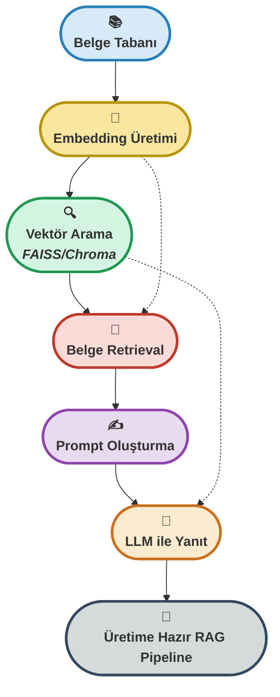

# 🧠 **Hafta 4: RAG Sistemi, Embedding ve Vektör Arama**


---

## 📁 Dosya Yapısı

Bu klasördeki ana dosyalar ve içerikleri:

| Dosya Adı                      | Açıklama                                                                                 |
|--------------------------------|-----------------------------------------------------------------------------------------|
| `01. embedding_tutorial.py`    | Embedding nedir, nasıl üretilir? SentenceTransformers ile temel embedding örnekleri      |
| `02. faiss_vector_search.py`   | FAISS ile vektör arama, benzerlik ölçümü ve hızlı retrieval                              |
| `03. chroma_vector_search.py`  | Chroma ile vektör tabanlı arama, veri ekleme ve sorgulama                               |
| `04. performance_comparison.py`| FAISS vs Chroma: hız, doğruluk ve ölçeklenebilirlik karşılaştırması                      |
| `05. simple_rag_demo.py`       | Basit RAG pipeline: embedding, retrieval, prompt ve LLM ile yanıt üretimi                |
| `06. rag_system.py`            | Açıklamalı tam RAG sistemi: belge tabanı, embedding, retrieval, LLM entegrasyonu         |
| `requirements.txt`             | Gerekli Python paketleri listesi                                                         |
| `README.md`                    | Haftanın özeti, kullanım talimatları, teknik açıklamalar ve ek kaynaklar                 |
| `images/`                      | Görseller ve analiz çıktıları                                                            |

Her dosya, modern LLM tabanlı arama ve bilgi getirme sistemlerinin temel yapı taşlarını örneklerle gösterir.

---

## 🎯 Haftanın Özeti
Bu hafta, **Retrieval-Augmented Generation (RAG)** mimarisinin temel bileşenlerini adım adım inceledim. Embedding üretimi, vektör tabanlı arama (FAISS & Chroma), belge retrieval ve LLM ile yanıt üretimi süreçlerini; hem teorik hem pratik olarak uyguladım. 

Her aşamada, vektör tabanlı arama algoritmalarının hız, doğruluk ve ölçeklenebilirlik açısından avantajlarını test ettim. RAG pipeline'ı ile, klasik LLM'lerin ötesinde, dış bilgi kaynaklarını kullanarak daha güvenilir ve güncel yanıtlar üretebilen bir sistem kurdum. 

Kodlarda, açıklamalı örnekler ve adım adım yorumlar ile, hem temel kavramları hem de üretim kalitesinde bir RAG sisteminin nasıl inşa edileceğini gösterdim.

---

## 🚦 RAG Pipeline ve Vektör Arama Yolculuğu

<p align="center" style="font-size:1.1em;">
	<b>🔎 Embedding → Vektör Arama → Belge Retrieval → LLM ile Yanıt<br>
	<span style="color:#2980B9;">FAISS</span> ve <span style="color:#CA6F1E;">Chroma</span> ile <span style="color:#229954;">hızlı</span>, <span style="color:#8E44AD;">doğru</span> ve <span style="color:#C0392B;">ölçeklenebilir</span> bilgi getirme!</b>
</p>



<p align="center" style="font-size:1.1em; margin-top:10px;">
	<b>✨ <span style="color:#229954;">Vektör tabanlı arama</span> ile <span style="color:#C0392B;">güçlü</span>, <span style="color:#CA6F1E;">hızlı</span> ve <span style="color:#8E44AD;">güncel</span> bilgiye erişim! ✨</b>
</p>

---

## � İçerik

### 1. Embedding Üretimi ve Temel Kavramlar  
**Dosya:** `01. embedding_tutorial.py`  
- Embedding nedir, neden gereklidir?
- SentenceTransformers ile metinleri vektöre dönüştürme
- Farklı embedding modellerinin karşılaştırılması
- Vektör uzayında benzerlik ölçümü

---

### 2. FAISS ile Vektör Arama ve Retrieval  
**Dosya:** `02. faiss_vector_search.py`  
- FAISS kütüphanesi ile hızlı vektör arama
- Cosine similarity ve nearest neighbor algoritmaları
- Büyük veri setlerinde ölçeklenebilir retrieval
- FAISS index oluşturma ve sorgulama

---

### 3. Chroma ile Alternatif Vektör Arama  
**Dosya:** `03. chroma_vector_search.py`  
- Chroma ile vektör tabanlı arama ve veri yönetimi
- Veri ekleme, güncelleme ve silme işlemleri
- Chroma'nın avantajları ve kullanım senaryoları

---

### 4. FAISS vs Chroma: Performans ve Doğruluk Karşılaştırması  
**Dosya:** `04. performance_comparison.py`  
- FAISS ve Chroma'nın hız, doğruluk ve kaynak kullanımı karşılaştırması
- Benchmark testleri ve görselleştirme
- Hangi senaryoda hangi sistem daha avantajlı?

---

### 5. Basit RAG Pipeline ile Bilgi Getirme  
**Dosya:** `05. simple_rag_demo.py`  
- RAG mimarisinin temel adımları
- Embedding, retrieval ve LLM ile yanıt üretimi
- Basit ve anlaşılır kod örnekleri

---

### 6. Açıklamalı Tam RAG Sistemi  
**Dosya:** `06. rag_system.py`  
- Adım adım açıklamalı RAG pipeline
- Belge tabanı oluşturma, embedding, retrieval, prompt ve LLM entegrasyonu
- Kodda Türkçe yorumlarla detaylı rehber

---

### 📝 Manuel Kurulum

#### 1. Sanal Ortam Oluştur
```bash
# macOS/Linux
python3 -m venv rag_bootcamp_env
source rag_bootcamp_env/bin/activate

# Windows
python -m venv rag_bootcamp_env
rag_bootcamp_env\Scripts\activate.bat
```

#### 2. Bağımlılıkları Yükle
```bash
pip install --upgrade pip
pip install -r requirements.txt
```

#### 3. Modülleri Çalıştır
```bash
# Embedding örnekleri
python 01. embedding_tutorial.py

# FAISS ile vektör arama
python 02. faiss_vector_search.py

# Chroma ile vektör arama
python 03. chroma_vector_search.py

# Performans karşılaştırması
python 04. performance_comparison.py

# Basit RAG demo
python 05. simple_rag_demo.py

# Tam RAG sistemi
python 06. rag_system.py
```

## 📋 Gereksinimler

```bash
pip install sentence-transformers faiss-cpu chromadb openai numpy python-dotenv
```

**GPU Desteği için:**
- FAISS: `pip install faiss-gpu` (opsiyonel)
- CUDA: FAISS ve LLM'ler için hızlandırma

---

## 🌟 Haftanın Aşamaları & Sıkça Sorulanlar

### 1. **Embedding Nedir, Nasıl Üretilir?**
- **Amaç:** Metinleri sayısal vektörlere dönüştürerek benzerlik ve retrieval işlemlerini mümkün kılmak.
- **Kod:**
	```python
	from sentence_transformers import SentenceTransformer
	model = SentenceTransformer('all-MiniLM-L6-v2')
	emb = model.encode(["RAG sistemleri bilgi getirme için kullanılır."])
	print(emb.shape)
	```
- <div style="border:1px solid #2980B9; border-radius:8px; padding:12px; background:#F4F8FB; margin:10px 0;">
	<b>Soru:</b> Embedding neden gereklidir?<br>
	<b>Cevap:</b> Metinleri vektöre çevirerek, benzerlik ve arama işlemlerini hızlı ve doğru şekilde yapmamızı sağlar.
	</div>

---

### 2. **FAISS ile Hızlı Vektör Arama**
- **Amaç:** Büyük veri setlerinde en yakın komşu aramasını hızlıca yapmak.
- **Kod:**
	```python
	import faiss
	index = faiss.IndexFlatL2(384)
	index.add(embeddings)
	D, I = index.search(query_emb, k=5)
	```
- <div style="border:1px solid #229954; border-radius:8px; padding:12px; background:#F4FBF4; margin:10px 0;">
	<b>Soru:</b> FAISS neden tercih edilir?<br>
	<b>Cevap:</b> Büyük veri setlerinde vektör aramasını çok hızlı ve verimli şekilde yapar.
	</div>

---

### 3. **Chroma ile Alternatif Vektör Arama**
- **Amaç:** Kolay veri yönetimi ve esnek arama işlemleri.
- **Kod:**
	```python
	import chromadb
	client = chromadb.Client()
	# Veri ekleme, sorgulama örnekleri
	```
- <div style="border:1px solid #CA6F1E; border-radius:8px; padding:12px; background:#FDEBD0; margin:10px 0;">
	<b>Soru:</b> Chroma'nın avantajı nedir?<br>
	<b>Cevap:</b> Kolay API, veri ekleme/güncelleme ve hızlı arama imkanı sunar.
	</div>

---

### 4. **FAISS vs Chroma: Benchmark ve Karşılaştırma**
- **Amaç:** Hangi vektör arama sistemi hangi senaryoda daha iyi?
- **Kod:**
	```python
	# Zaman ve doğruluk ölçümü kodları
	```
- <div style="border:1px solid #C0392B; border-radius:8px; padding:12px; background:#FDF2F0; margin:10px 0;">
	<b>Soru:</b> FAISS mi Chroma mı?
	<b>Cevap:</b> Büyük veri ve hız için FAISS, kolaylık ve esneklik için Chroma öne çıkar.
	</div>

---

### 5. **RAG Pipeline ile Bilgi Getirme**
- **Amaç:** Dış bilgi kaynaklarını LLM ile birleştirerek daha doğru ve güncel yanıtlar üretmek.
- **Kod:**
	```python
	# Basit RAG pipeline örneği
	```
- <div style="border:1px solid #8E44AD; border-radius:8px; padding:12px; background:#F7F1FA; margin:10px 0;">
	<b>Soru:</b> RAG neden önemlidir?<br>
	<b>Cevap:</b> LLM'lerin dış bilgiyle güncellenmesini ve daha güvenilir yanıtlar üretmesini sağlar.
	</div>

---

### 6. **Açıklamalı Tam RAG Sistemi**
- **Amaç:** Üretim kalitesinde, adım adım açıklamalı bir RAG pipeline kurmak.
- **Kod:**
	```python
	# 06. rag_system.py dosyasında detaylı açıklamalar ve adım adım kod
	```
- <div style="border:1px solid #34495E; border-radius:8px; padding:12px; background:#F4F6F7; margin:10px 0;">
	<b>Soru:</b> Kodda Türkçe açıklamalar neden önemli?<br>
	<b>Cevap:</b> Her adımın mantığını ve işlevini kolayca anlamayı sağlar, öğrenme ve üretim sürecini hızlandırır.
	</div>

---

## 💡 En İyi Uygulamalar

### Embedding ve Retrieval
```python
# ✅ İyi
embeddings = model.encode(texts)
index.add(embeddings)
D, I = index.search(query_emb, k=5)

# ❌ Kötü
# Metinleri doğrudan aramak (vektörsüz)
```

### RAG Pipeline
```python
# ✅ İyi
prompt = create_rag_prompt(query, context_docs)
response = answer_with_openai(prompt)

# ❌ Kötü
# Sadece LLM'e ham soru göndermek
```

---

<p align="center" style="font-size:1.1em;">
	<b>🌟 <span style="color:#CA6F1E;">Vektör arama ve RAG pipeline</span>, <span style="color:#229954;">güvenilir bilgiye erişimin anahtarıdır!</span> 🌟</b>
</p>

<br>

<table align="center">
	<thead>
		<tr>
			<th style="background:#D6EAF8; color:#2980B9;"><b>Arama Sistemi</b></th>
			<th style="background:#F9E79F; color:#B7950B;"><b>Hız</b></th>
			<th style="background:#D5F5E3; color:#229954;"><b>Doğruluk</b></th>
			<th style="background:#FADBD8; color:#C0392B;"><b>Kolaylık</b></th>
		</tr>
	</thead>
	<tbody>
		<tr>
			<td><b>FAISS</b></td>
			<td><span style="color:#229954;"><b>Çok Yüksek</b></span></td>
			<td>Yüksek</td>
			<td>Orta</td>
		</tr>
		<tr>
			<td><b>Chroma</b></td>
			<td>Yüksek</td>
			<td>Orta</td>
			<td><b style="color:#CA6F1E;">Çok Kolay</b></td>
		</tr>
		<tr>
			<td><b>Klasik Arama</b></td>
			<td>Düşük</td>
			<td>Düşük</td>
			<td>Kolay</td>
		</tr>
	</tbody>
</table>

---

## 📚 Ek Kaynaklar

> RAG ve vektör arama sistemleri için başvurduğum **önemli referanslar**:

<details>
<summary>📘 SentenceTransformers Documentation</summary>
<a href="https://www.sbert.net/docs/" target="_blank">https://www.sbert.net/docs/</a>  
🔎 Embedding modelleri, kullanım örnekleri ve API açıklamaları.
</details>

<details>
<summary>⚡ FAISS Documentation</summary>
<a href="https://faiss.ai/" target="_blank">https://faiss.ai/</a>  
⚙️ Vektör arama algoritmaları, index tipleri ve performans analizleri.
</details>

<details>
<summary>📑 Chroma Documentation</summary>
<a href="https://docs.trychroma.com/" target="_blank">https://docs.trychroma.com/</a>  
🧩 Chroma'nın API ve kullanım örnekleri.
</details>

<details>
<summary>📝 OpenAI API Documentation</summary>
<a href="https://platform.openai.com/docs/" target="_blank">https://platform.openai.com/docs/</a>  
✒️ LLM entegrasyonu ve API kullanımı.
</details>

<details>
<summary>🔄 RAG Paper (Lewis et al., 2020)</summary>
<a href="https://arxiv.org/abs/2005.11401" target="_blank">https://arxiv.org/abs/2005.11401</a>  
🌐 RAG mimarisinin orijinal makalesi ve teknik detayları.
</details>