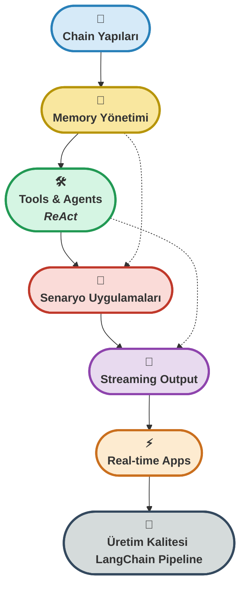

# 🔗 **Hafta 5: İleri Düzey LangChain - Chain, Memory, Tools ve Streaming**


---

## 📁 Dosya Yapısı

Bu klasördeki ana dosyalar ve içerikleri:

| Dosya Adı                      | Açıklama                                                                                 |
|--------------------------------|-----------------------------------------------------------------------------------------|
| `1_chains_basic.py`            | Chain yapıları, LLMChain, SequentialChain ve özel output parser örnekleri               |
| `2_memory_examples.py`         | Memory türleri: Buffer, Window, Summary ve Token-based memory kullanımı                 |
| `3_tools_and_agents.py`       | Tool oluşturma, agent türleri ve ReAct agents ile karmaşık görev yönetimi               |
| `4_scenario_applications.py`   | Gerçek hayat senaryoları: Müşteri hizmetleri, içerik oluşturma ve eğitim asistanları     |
| `5_streaming_examples.py`     | Streaming output, real-time chat ve async işlemler                                      |
| `setup_venv.py`               | Otomatik sanal ortam kurulumu ve bağımlılık yönetimi                                    |
| `test_installation.py`        | Kurulum doğrulama ve sistem testi                                                       |
| `requirements.txt`            | Gerekli Python paketleri listesi (LangChain, OpenAI, async libs)                       |
| `homework.md`                 | Haftalık ödev ve uygulama projeleri                                                     |
| `README.md`                   | Haftanın özeti, kullanım talimatları, teknik açıklamalar ve ek kaynaklar                |

Her dosya, modern LLM tabanlı uygulama geliştirme için LangChain framework'ünün güçlü özelliklerini pratik örneklerle gösterir.

---

## 🎯 Haftanın Özeti
Bu hafta, **LangChain** framework'ünün ileri seviye özelliklerini adım adım inceledim. Chain yapıları ile karmaşık işlem akışları, memory türleri ile konuşma geçmişi yönetimi, tool oluşturma ve agent kullanımı ile otomasyon, son olarak streaming output ile kullanıcı deneyimi iyileştirme konularını; hem teorik hem pratik olarak uyguladım.

Her aşamada, LangChain'in modüler yapısının sunduğu esneklik ve güçlü özellikleri test ettim. Chain'lerin nasıl birleştirilebileceği, memory optimizasyonları, özel tool'lar ve gerçek zamanlı uygulamalar ile modern LLM tabanlı sistemlerin nasıl inşa edileceğini gösterdim.

Kodlarda, açıklamalı örnekler ve adım adım yorumlar ile, hem temel kavramları hem de üretim kalitesinde LangChain uygulamalarının nasıl geliştirebileceğini pratik örneklerle sundum.

---

## 🚦 LangChain Pipeline ve İleri Seviye Özellikler Yolculuğu

<p align="center" style="font-size:1.1em;">
	<b>🔗 Chain → Memory → Tools → Agents → Streaming<br>
	<span style="color:#2980B9;">LangChain</span> ile <span style="color:#CA6F1E;">güçlü</span>, <span style="color:#229954;">esnek</span> ve <span style="color:#8E44AD;">ölçeklenebilir</span> LLM uygulamaları!</b>
</p>



<p align="center" style="font-size:1.1em; margin-top:10px;">
	<b>✨ <span style="color:#229954;">LangChain framework</span> ile <span style="color:#C0392B;">profesyonel</span>, <span style="color:#CA6F1E;">hızlı</span> ve <span style="color:#8E44AD;">akıllı</span> LLM uygulamaları! ✨</b>
</p>

---

## � İçerik

### 1. Chain Yapıları ve Temel Bileşenler  
**Dosya:** `1_chains_basic.py`  
- LLMChain: Temel zincir yapısı ve kullanımı
- SimpleSequentialChain: Basit sıralı işlem zincirleri
- SequentialChain: Karmaşık veri akışları ve çoklu çıktılar
- Custom Output Parser: Özel çıktı formatları ve işleyiciler

---

### 2. Memory Yönetimi ve Optimizasyon Stratejileri  
**Dosya:** `2_memory_examples.py`  
- ConversationBufferMemory: Tam konuşma geçmişi saklama
- ConversationBufferWindowMemory: Sınırlı mesaj penceresi
- ConversationSummaryMemory: Akıllı konuşma özetleme
- ConversationTokenBufferMemory: Token tabanlı memory yönetimi

---

### 3. Tools ve Agents ile Otomasyon  
**Dosya:** `3_tools_and_agents.py`  
- Basit Tool oluşturma: Matematik, zaman, metin işleme araçları
- Özel Tool sınıfları: API entegrasyonları ve dış servis bağlantıları
- ReAct Agents: Modern reasoning ve action döngüsü
- Memory destekli Agents: Konuşma geçmişi tutan otonom sistemler

---

### 4. Gerçek Hayat Senaryoları ve Uygulama Örnekleri  
**Dosya:** `4_scenario_applications.py`  
- Müşteri Hizmetleri Botu: Sipariş takibi ve destek sistemleri
- İçerik Oluşturma Asistanı: Araştırma, planlama ve yazım otomasyonu
- Eğitim Planlama Asistanı: Kişiselleştirilmiş öğrenim yolları

---

### 5. Streaming ve Real-time Uygulamalar  
**Dosya:** `5_streaming_examples.py`  
- Temel Streaming: Gerçek zamanlı output akışı
- Özel Callback Handler'lar: İlerleme gösterimi ve kullanıcı etkileşimi
- Real-time Chat Bot: Canlı sohbet deneyimi
- Async Streaming: Asenkron işlemler ve performans optimizasyonu

---

### � Manuel Kurulum

#### 1. Sanal Ortam Oluştur
```bash
# macOS/Linux
python3 -m venv hafta5_env
source hafta5_env/bin/activate

# Windows
python -m venv hafta5_env
hafta5_env\Scripts\activate.bat
```

#### 2. Bağımlılıkları Yükle
```bash
pip install --upgrade pip
pip install -r requirements.txt
```

#### 3. Environment Değişkenlerini Ayarla
`.env` dosyası oluşturun:
```
OPENAI_API_KEY=your-openai-api-key-here
```

#### 4. Modülleri Çalıştır
```bash
# Chain yapıları örnekleri
python 1_chains_basic.py

# Memory kullanımı örnekleri
python 2_memory_examples.py

# Tools ve agents
python 3_tools_and_agents.py

# Senaryo uygulamaları
python 4_scenario_applications.py

# Streaming örnekleri
python 5_streaming_examples.py

# Kurulum testi
python test_installation.py
```

## 📋 Gereksinimler

```bash
pip install langchain openai python-dotenv asyncio aiohttp
```

**Ek Bağımlılıklar:**
- LangChain: Framework temel bileşenleri
- OpenAI: LLM API entegrasyonu
- Async: Real-time ve streaming işlemler

---

## 🌟 Haftanın Aşamaları & Sıkça Sorulanlar

### 1. **Chain Yapıları Nedir, Nasıl Kullanılır?**
- **Amaç:** Karmaşık işlem akışlarını modüler ve yeniden kullanılabilir bileşenlere bölerek yönetmek.
- **Kod:**
	```python
	from langchain.chains import LLMChain, SimpleSequentialChain
	from langchain.prompts import PromptTemplate
	
	chain1 = LLMChain(llm=llm, prompt=prompt1)
	chain2 = LLMChain(llm=llm, prompt=prompt2)
	overall_chain = SimpleSequentialChain(chains=[chain1, chain2])
	```
- <div style="border:1px solid #2980B9; border-radius:8px; padding:12px; background:#F4F8FB; margin:10px 0;">
	<b>Soru:</b> Chain'ler neden gereklidir?<br>
	<b>Cevap:</b> Karmaşık görevleri küçük adımlara bölerek, daha kolay test edilebilir ve sürdürülebilir kod yazmamızı sağlar.
	</div>

---

### 2. **Memory Türleri ve Optimizasyon**
- **Amaç:** Konuşma geçmişini verimli şekilde yönetmek ve token limitlerini optimize etmek.
- **Kod:**
	```python
	from langchain.memory import ConversationBufferWindowMemory
	memory = ConversationBufferWindowMemory(k=5)
	chain = ConversationChain(llm=llm, memory=memory)
	```
- <div style="border:1px solid #229954; border-radius:8px; padding:12px; background:#F4FBF4; margin:10px 0;">
	<b>Soru:</b> Hangi memory türünü seçmeliyim?<br>
	<b>Cevap:</b> Kısa konuşmalar için Buffer, uzun konuşmalar için Summary, orta seviye için Window memory ideal.
	</div>

---

### 3. **Tools ve Agents ile Otomasyon**
- **Amaç:** LLM'lerin dış API'lar ve araçlarla etkileşime girmesini sağlamak.
- **Kod:**
	```python
	from langchain.agents import initialize_agent, Tool
	tools = [Tool(name="Calculator", func=calculator, description="Math operations")]
	agent = initialize_agent(tools, llm, agent="zero-shot-react-description")
	```
- <div style="border:1px solid #CA6F1E; border-radius:8px; padding:12px; background:#FDEBD0; margin:10px 0;">
	<b>Soru:</b> ReAct agents nedir?<br>
	<b>Cevap:</b> Reasoning (düşünme) ve Acting (eylem) döngüsü ile karmaşık görevleri çözebilen modern agent yapısıdır.
	</div>

---

### 4. **Senaryo Bazlı Uygulamalar**
- **Amaç:** Gerçek iş problemlerini LangChain ile çözmek ve end-to-end uygulamalar geliştirmek.
- **Kod:**
	```python
	# Müşteri hizmetleri botu örneği
	```
- <div style="border:1px solid #C0392B; border-radius:8px; padding:12px; background:#FDF2F0; margin:10px 0;">
	<b>Soru:</b> Üretim ortamı için hangi hususlar önemli?<br>
	<b>Cevap:</b> Error handling, rate limiting, memory optimizasyonu ve güvenlik önlemleri kritik faktörlerdir.
	</div>

---

### 5. **Streaming ve Real-time Uygulamalar**
- **Amaç:** Kullanıcı deneyimini iyileştirmek için real-time output sağlamak.
- **Kod:**
	```python
	for chunk in llm.stream("Soru"):
	    print(chunk, end="", flush=True)
	```
- <div style="border:1px solid #8E44AD; border-radius:8px; padding:12px; background:#F7F1FA; margin:10px 0;">
	<b>Soru:</b> Streaming neden önemlidir?<br>
	<b>Cevap:</b> Uzun yanıtlarda kullanıcının bekleme süresini azaltır ve daha doğal bir konuşma deneyimi sağlar.
	</div>

---

## 💡 En İyi Uygulamalar

### Chain Tasarımı
```python
# ✅ İyi
chain = LLMChain(llm=llm, prompt=prompt, verbose=True)
result = chain.run(input_text)

# ❌ Kötü
# Tek prompt ile tüm işlemleri yapmaya çalışmak
```

### Memory Yönetimi
```python
# ✅ İyi
memory = ConversationBufferWindowMemory(k=10)
# Token limitini göz önünde bulundur

# ❌ Kötü
# Sınırsız memory kullanmak
```

### Agent Error Handling
```python
# ✅ İyi
try:
    result = agent.run(query)
except Exception as e:
    logger.error(f"Agent error: {e}")
    return fallback_response

# ❌ Kötü
# Error handling olmadan agent çalıştırmak
```

---

<p align="center" style="font-size:1.1em;">
	<b>🌟 <span style="color:#CA6F1E;">LangChain framework</span>, <span style="color:#229954;">güçlü LLM uygulamalarının anahtarıdır!</span> 🌟</b>
</p>

<br>

<table align="center">
	<thead>
		<tr>
			<th style="background:#D6EAF8; color:#2980B9;"><b>Özellik</b></th>
			<th style="background:#F9E79F; color:#B7950B;"><b>Basit Yaklaşım</b></th>
			<th style="background:#D5F5E3; color:#229954;"><b>LangChain</b></th>
			<th style="background:#FADBD8; color:#C0392B;"><b>Avantaj</b></th>
		</tr>
	</thead>
	<tbody>
		<tr>
			<td><b>Chain Yönetimi</b></td>
			<td>Tek prompt</td>
			<td><span style="color:#229954;"><b>Modüler Chain'ler</b></span></td>
			<td>Yeniden kullanılabilir</td>
		</tr>
		<tr>
			<td><b>Memory</b></td>
			<td>Manuel saklama</td>
			<td><b style="color:#CA6F1E;">Otomatik Memory</b></td>
			<td>Optimize edilmiş</td>
		</tr>
		<tr>
			<td><b>Tool Integration</b></td>
			<td>Karmaşık kod</td>
			<td>Basit API</td>
			<td><b style="color:#8E44AD;">Çok Kolay</b></td>
		</tr>
		<tr>
			<td><b>Streaming</b></td>
			<td>Manuel impl.</td>
			<td>Built-in</td>
			<td>Hazır çözüm</td>
		</tr>
	</tbody>
</table>

---

## 📚 Ek Kaynaklar

> LangChain framework ve ileri seviye LLM uygulamaları için başvurduğum **önemli referanslar**:

<details>
<summary>📘 LangChain Documentation</summary>
<a href="https://python.langchain.com/docs/get_started" target="_blank">https://python.langchain.com/docs/get_started</a>  
🔎 Framework genel özellikleri, kurulum ve temel kullanım örnekleri.
</details>

<details>
<summary>⚡ Chain Examples</summary>
<a href="https://python.langchain.com/docs/modules/chains" target="_blank">https://python.langchain.com/docs/modules/chains</a>  
⚙️ Farklı chain türleri, kullanım senaryoları ve best practice'ler.
</details>

<details>
<summary>📑 Memory Guide</summary>
<a href="https://python.langchain.com/docs/modules/memory" target="_blank">https://python.langchain.com/docs/modules/memory</a>  
🧩 Memory türleri, optimizasyon stratejileri ve performans ipuçları.
</details>

<details>
<summary>📝 Agent Cookbook</summary>
<a href="https://python.langchain.com/docs/modules/agents" target="_blank">https://python.langchain.com/docs/modules/agents</a>  
✒️ Agent türleri, tool entegrasyonu ve ReAct pattern implementasyonu.
</details>

<details>
<summary>🔄 OpenAI API Documentation</summary>
<a href="https://platform.openai.com/docs/" target="_blank">https://platform.openai.com/docs/</a>  
🌐 LLM API kullanımı, streaming ve rate limiting rehberi.
</details>

## 💡 İpuçları

- Her örneği adım adım çalıştırın
- Kod üzerinde değişiklikler yaparak deneyin  
- Error mesajlarını okuyun ve anlayın
- Verbose=True ile debug yapın
- API key'inizi güvenli tutun

**Başarılar! 🚀**