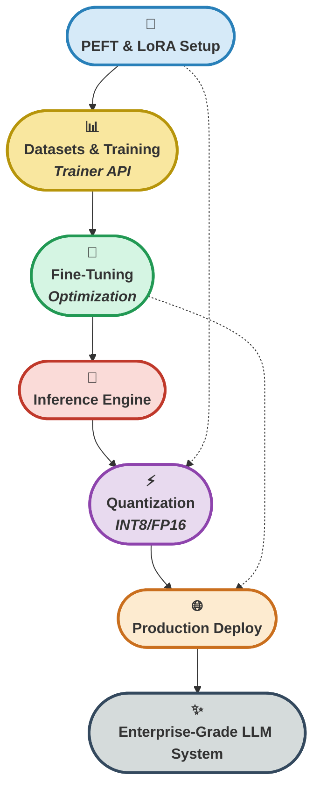

# 🎯 **Hafta 6: Model Fine-Tuning - PEFT, LoRA ve Production Inference**


---

## 📁 Dosya Yapısı

Bu klasördeki ana dosyalar ve içerikleri:

| Dosya Adı                           | Açıklama                                                                                        |
|-------------------------------------|-------------------------------------------------------------------------------------------------|
| `1_peft_lora.py`                    | PEFT ve LoRA ile parameter-efficient fine-tuning, model optimizasyonu ve eğitim süreçleri      |
| `2_datasets_trainer.py`             | Hugging Face Datasets ve Trainer API kullanımı, özel metrik hesaplama ve veri yönetimi         |
| `3_inference_personalization.py`    | Production inference, kişiselleştirilmiş chatbot, quantization ve deployment stratejileri      |
| `requirements.txt`                  | Gerekli Python paketleri (transformers, PEFT, datasets, torch, accelerate, bitsandbytes)       |
| `README.md`                         | Haftanın özeti, kullanım talimatları, teknik açıklamalar ve best practices                     |
| `fine_tuned_model/`                 | Fine-tune edilmiş model checkpointleri ve konfigürasyon dosyaları                              |
| `lora_model/`                       | LoRA adapter modeli, tokenizer ve eğitim parametreleri                                          |
| `lora_results/`                     | LoRA eğitim checkpointleri (checkpoint-4, checkpoint-6)                                         |
| `results/`                          | Full fine-tuning eğitim checkpointleri (checkpoint-1, 2, 3)                                     |

Her dosya, modern LLM fine-tuning teknikleri, memory-efficient eğitim yöntemleri ve production-ready inference implementasyonlarını detaylı örneklerle gösterir.

---

## 🎯 Haftanın Özeti

Bu hafta, **Large Language Model (LLM)** fine-tuning süreçlerinin profesyonel düzeyde uygulanmasını öğrendim. **PEFT (Parameter Efficient Fine-Tuning)** ve **LoRA (Low-Rank Adaptation)** teknikleri ile büyük modelleri minimum kaynak kullanımıyla nasıl özelleştireceğimi, **Hugging Face Datasets** ve **Trainer API** ile modern veri pipeline'ları nasıl oluşturacağımı, ve production ortamında **inference optimization** ile **model deployment** stratejilerini nasıl uygulayacağımı öğrendim.

Her aşamada, memory-efficient training teknikleri, quantization stratejileri, custom metric hesaplama, real-time inference optimizasyonu ve production deployment best practices'leri ile LLM'leri gerçek dünya uygulamalarında nasıl kullanabileceğimi pratik örneklerle deneyimledim.

Kodlarda, detaylı açıklamalar ve step-by-step implementasyonlar ile hem temel kavramları hem de enterprise-grade LLM uygulamalarının nasıl geliştirebileceğini kapsamlı örneklerle sundum.

---

## 🚦 Fine-Tuning ve Inference Pipeline Yolculuğu

<p align="center" style="font-size:1.1em;">
	<b>🎯 PEFT & LoRA → Datasets & Training → Inference & Deployment<br>
	<span style="color:#2980B9;">Modern LLM</span> ile <span style="color:#CA6F1E;">verimli</span>, <span style="color:#229954;">ölçeklenebilir</span> ve <span style="color:#8E44AD;">production-ready</span> çözümler!</b>
</p>



<p align="center" style="font-size:1.1em; margin-top:10px;">
	<b>✨ <span style="color:#229954;">PEFT & LoRA</span> ile <span style="color:#C0392B;">%96+ memory tasarrufu</span>, <span style="color:#CA6F1E;">hızlı eğitim</span> ve <span style="color:#8E44AD;">production-ready</span> LLM sistemleri! ✨</b>
</p>

---

## 📚 İçerik

### 1. PEFT ve LoRA ile Memory-Efficient Fine-Tuning  
**Dosya:** `1_peft_lora.py`  
- **LoRA (Low-Rank Adaptation):** Düşük rankli matris decomposition ile parameter-efficient training
- **PEFT Configuration:** Rank (r), Alpha (α), Dropout ve target modules optimizasyonu
- **Memory Optimization:** %96+ parametre tasarrufu ile büyük modelleri küçük GPU'larda eğitme
- **Adapter Training:** Orijinal modeli freeze ederek sadece adapter katmanları eğitme
- **Model Analysis:** Trainable vs frozen parameters detaylı analizi
- **Checkpoint Management:** Model kaydetme, yükleme ve versiyonlama

**Teknik Detaylar:**
```python
# LoRA Matematiksel Formül: W = W₀ + ΔW = W₀ + BA
# W₀: Frozen original weights (1024×1024 = 1,048,576 params)
# B×A: Low-rank matrices (1024×16 + 16×1024 = 32,768 params)
# Tasarruf: %96.9 daha az eğitilebilir parametre!

lora_config = LoraConfig(
    r=16,                    # Rank değeri
    lora_alpha=32,           # Scaling factor (α/r = 2.0)
    target_modules=["c_attn", "c_proj"],  # Attention layers
    lora_dropout=0.1,
    task_type=TaskType.CAUSAL_LM
)
```

---

### 2. Hugging Face Datasets ve Trainer API Kullanımı  
**Dosya:** `2_datasets_trainer.py`  
- **Dataset Management:** Veri yükleme, preprocessing ve augmentation
- **Tokenization Pipeline:** Batch tokenization, padding ve truncation stratejileri
- **Trainer API:** High-level training interface ile otomatik eğitim loop
- **Training Arguments:** Learning rate scheduling, warmup, gradient accumulation
- **Custom Metrics:** Accuracy, Precision, Recall, F1-Score hesaplama
- **Evaluation Strategy:** Training sırasında validation ve early stopping
- **Data Collator:** Dynamic padding ile memory optimizasyonu

**Best Practices:**
```python
training_args = TrainingArguments(
    output_dir="./results",
    num_train_epochs=3,
    per_device_train_batch_size=8,
    gradient_accumulation_steps=4,  # Effective batch = 32
    warmup_steps=500,
    weight_decay=0.01,
    logging_steps=10,
    evaluation_strategy="steps",
    eval_steps=100,
    save_strategy="epoch",
    load_best_model_at_end=True,
    fp16=True  # Mixed precision training
)
```

---

### 3. Production Inference ve Kişiselleştirme  
**Dosya:** `3_inference_personalization.py`  
- **Inference Engine:** PersonalizedInference sınıfı ile production-ready inference
- **Generation Strategies:** Deterministik vs yaratıcı text generation
- **Quantization Techniques:** INT8, FP16, FP32 model optimizasyonu
- **Batch Processing:** Multi-sample inference ile throughput optimizasyonu
- **KV-Cache Optimization:** Memory ve speed optimizasyonu
- **Personalized Chatbot:** User profile bazlı kişiselleştirilmiş yanıtlar
- **Deployment Strategies:** REST API, gRPC, Docker ve Kubernetes

**Inference Optimization:**
```python
# 1. Quantization (8-bit inference)
model = AutoModelForCausalLM.from_pretrained(
    model_path,
    load_in_8bit=True,
    device_map="auto"
)

# 2. Generation Config
generation_config = {
    # Deterministik (faktüel içerik)
    "deterministic": {
        "temperature": 0.1,
        "do_sample": False,
        "num_beams": 1
    },
    # Yaratıcı (blog, hikaye)
    "creative": {
        "temperature": 0.9,
        "top_p": 0.95,
        "top_k": 50,
        "do_sample": True
    }
}

# 3. Batch Inference
results = model.generate(
    input_ids_batch,
    max_new_tokens=100,
    use_cache=True  # KV-cache optimization
)
```

---

## 🛠️ Kurulum ve Kullanım

### 📦 Gereksinimler

```bash
# Ana bağımlılıklar
torch>=2.0.0
transformers>=4.21.0
datasets>=2.14.0
peft>=0.4.0
accelerate>=0.21.0
bitsandbytes>=0.41.0

# Yardımcı kütüphaneler
scikit-learn>=1.3.0
numpy>=1.24.0
tqdm>=4.65.0
```

### 🚀 Hızlı Başlangıç

#### 1. Sanal Ortam Oluştur
```powershell
# Windows PowerShell
python -m venv venv
.\venv\Scripts\Activate.ps1

# Bağımlılıkları yükle
pip install --upgrade pip
pip install -r requirements.txt
```

#### 2. PEFT & LoRA Fine-Tuning
```powershell
# LoRA ile model eğitimi
python 1_peft_lora.py

# Çıktılar:
# - ./lora_results/        → Eğitim checkpointleri
# - ./lora_model/          → Final LoRA adapter modeli
```

#### 3. Datasets & Trainer Kullanımı
```powershell
# Trainer API ile model eğitimi
python 2_datasets_trainer.py

# Çıktılar:
# - ./results/             → Full fine-tuning checkpointleri
# - ./fine_tuned_model/    → Final model
```

#### 4. Production Inference
```powershell
# Inference ve deployment örnekleri
python 3_inference_personalization.py

# Test senaryoları:
# - Quantization techniques
# - Generation strategies
# - Personalized chatbot
# - Performance benchmarking
```

---

## 🌟 Haftanın Aşamaları & Sıkça Sorulanlar

### 1. **PEFT ve LoRA Nedir? Neden Kullanılır?**

<div style="border:1px solid #2980B9; border-radius:8px; padding:12px; background:#F4F8FB; margin:10px 0;">

**Soru:** PEFT ve LoRA teknikleri ne işe yarar?

**Cevap:** PEFT (Parameter Efficient Fine-Tuning), büyük modellerin tüm parametrelerini eğitmek yerine sadece küçük bir kısmını veya adapter katmanlarını eğitme yaklaşımıdır. LoRA, bu yaklaşımın en popüler implementasyonudur.

**Avantajlar:**
- 💾 **Memory Tasarrufu:** %96+ daha az eğitilebilir parametre
- ⚡ **Hızlı Eğitim:** Daha az parametre = daha hızlı backpropagation
- 💰 **Maliyet Düşürme:** Küçük GPU'larda büyük modeller eğitilebilir
- 🔄 **Modülerlik:** Farklı görevler için farklı adapter'lar

**Matematiksel Temel:**
```
W = W₀ + ΔW = W₀ + BA

W₀: Orijinal ağırlıklar (frozen)
B, A: Düşük rankli matrisler (trainable)
rank(BA) << rank(W₀)

Örnek: 1024×1024 matris → 1M parametre
LoRA (r=16): (1024×16) + (16×1024) = 32K parametre
Tasarruf: %96.9!
```

</div>

**Kod Örneği:**
```python
from peft import LoraConfig, get_peft_model

# LoRA konfigürasyonu
lora_config = LoraConfig(
    r=16,                           # Rank (düşük = az parametre, yüksek = fazla kapasite)
    lora_alpha=32,                  # Scaling factor
    target_modules=["c_attn"],      # Hangi katmanlar eğitilecek
    lora_dropout=0.1,
    task_type=TaskType.CAUSAL_LM
)

# Modele LoRA adapter ekle
model = get_peft_model(base_model, lora_config)

# Parametre analizi
model.print_trainable_parameters()
# trainable params: 294,912 || all params: 124,734,720 || trainable%: 0.24%
```

---

### 2. **Datasets ve Trainer API ile Eğitim**

<div style="border:1px solid #229954; border-radius:8px; padding:12px; background:#F4FBF4; margin:10px 0;">

**Soru:** Hugging Face Datasets ve Trainer API neden kullanılır?

**Cevap:** Datasets kütüphanesi, büyük veri setlerini memory-efficient şekilde yönetir. Trainer API ise training loop'u otomatikleştirir ve best practices'leri uygular.

**Datasets Avantajları:**
- 📊 **Memory Mapping:** RAM'i optimize eder
- ⚡ **Apache Arrow:** Hızlı okuma/yazma
- 🔄 **Lazy Loading:** Sadece gerekli veri yüklenir
- 🛠️ **Preprocessing:** Batch tokenization ve transformations

**Trainer API Avantajları:**
- 🤖 **Otomatik Training Loop:** Forward, backward, optimizer steps
- 📈 **Built-in Logging:** TensorBoard, WandB entegrasyonu
- 💾 **Checkpoint Management:** Otomatik kaydetme ve yükleme
- 🎯 **Evaluation:** Validation ve metrics hesaplama

</div>

**Kod Örneği:**
```python
from transformers import TrainingArguments, Trainer

# Training parametreleri
training_args = TrainingArguments(
    output_dir="./results",
    num_train_epochs=3,
    per_device_train_batch_size=8,
    gradient_accumulation_steps=4,    # Effective batch size = 32
    warmup_steps=500,                 # Learning rate warmup
    weight_decay=0.01,                # L2 regularization
    logging_steps=10,
    evaluation_strategy="steps",
    eval_steps=100,
    save_strategy="epoch",
    load_best_model_at_end=True,
    metric_for_best_model="eval_loss",
    fp16=True                         # Mixed precision training
)

# Trainer oluştur
trainer = Trainer(
    model=model,
    args=training_args,
    train_dataset=train_dataset,
    eval_dataset=eval_dataset,
    compute_metrics=compute_metrics
)

# Eğitimi başlat
trainer.train()
```

---

### 3. **Inference Optimization Teknikleri**

<div style="border:1px solid #CA6F1E; border-radius:8px; padding:12px; background:#FDEBD0; margin:10px 0;">

**Soru:** Production ortamında inference nasıl optimize edilir?

**Cevap:** Quantization, batch processing, KV-cache ve generation config optimizasyonları ile hem hız hem memory kullanımı iyileştirilebilir.

**Optimizasyon Teknikleri:**

1. **Quantization (Niceleme)**
   - INT8: %50 bellek tasarrufu, minimal accuracy kaybı
   - FP16: %50 bellek tasarrufu, hız artışı
   - 4-bit: %75 bellek tasarrufu, consumer GPU'larda kullanım

2. **Batch Processing**
   - Birden fazla örneği aynı anda işleme
   - Throughput artışı (%200-400)
   - GPU utilization iyileştirme

3. **KV-Cache Optimization**
   - Attention cache'i tekrar kullanma
   - Autoregressive generation hızlandırma
   - Memory-speed trade-off

4. **Generation Config**
   - Temperature, top_p, top_k ayarları
   - Beam search vs sampling
   - Deterministik vs yaratıcı üretim

</div>

**Kod Örneği:**
```python
# 1. INT8 Quantization
from transformers import AutoModelForCausalLM
import torch

model = AutoModelForCausalLM.from_pretrained(
    "model_path",
    load_in_8bit=True,              # INT8 quantization
    device_map="auto",               # Otomatik device mapping
    torch_dtype=torch.float16       # FP16 computation
)

# 2. Batch Inference
input_ids_batch = tokenizer(
    ["Prompt 1", "Prompt 2", "Prompt 3"],
    return_tensors="pt",
    padding=True
)

outputs = model.generate(
    **input_ids_batch,
    max_new_tokens=100,
    use_cache=True,                 # KV-cache aktif
    num_beams=1,                    # Greedy decoding (hızlı)
    do_sample=False                 # Deterministik
)

# 3. Generation Config
from transformers import GenerationConfig

# Faktüel içerik için
factual_config = GenerationConfig(
    temperature=0.1,
    do_sample=False,
    num_beams=1
)

# Yaratıcı içerik için
creative_config = GenerationConfig(
    temperature=0.9,
    top_p=0.95,
    top_k=50,
    do_sample=True
)

output = model.generate(
    input_ids,
    generation_config=creative_config
)
```

---

### 4. **Kişiselleştirilmiş Chatbot Tasarımı**

<div style="border:1px solid #C0392B; border-radius:8px; padding:12px; background:#FDF2F0; margin:10px 0;">

**Soru:** Kullanıcı profiline göre kişiselleştirilmiş yanıtlar nasıl oluşturulur?

**Cevap:** User profile, conversation history ve context-aware prompting ile LLM'ler her kullanıcıya özel yanıtlar üretebilir.

**Kişiselleştirme Stratejileri:**

1. **User Profile Management**
   - Kullanıcı tercihlerini saklama
   - İlgi alanları ve uzmanlık seviyesi
   - Konuşma tarzı (formal/casual)

2. **Context-Aware Prompting**
   - Geçmiş konuşma geçmişi
   - Kullanıcı metadata'sı
   - Dinamik prompt construction

3. **Adaptive Generation**
   - Kullanıcı feedback'ine göre ayarlama
   - A/B testing ile optimizasyon
   - Reinforcement learning from human feedback (RLHF)

</div>

**Kod Örneği:**
```python
class PersonalizedChatbot:
    def __init__(self, model, tokenizer):
        self.model = model
        self.tokenizer = tokenizer
        self.user_profiles = {}
        
    def create_user_profile(self, user_id, preferences):
        """Kullanıcı profili oluştur"""
        self.user_profiles[user_id] = {
            "name": preferences.get("name"),
            "expertise": preferences.get("expertise", "beginner"),
            "interests": preferences.get("interests", []),
            "tone": preferences.get("tone", "professional"),
            "conversation_history": []
        }
    
    def generate_response(self, user_id, query):
        """Kişiselleştirilmiş yanıt üret"""
        profile = self.user_profiles.get(user_id)
        
        # Kişiselleştirilmiş prompt oluştur
        system_prompt = f"""
        Kullanıcı: {profile['name']}
        Seviye: {profile['expertise']}
        İlgi Alanları: {', '.join(profile['interests'])}
        Ton: {profile['tone']}
        
        Yukarıdaki profili dikkate alarak yanıt ver.
        """
        
        # Conversation history ekle
        context = "\n".join(profile['conversation_history'][-5:])
        
        full_prompt = f"{system_prompt}\n\nGeçmiş:\n{context}\n\nSoru: {query}\n\nYanıt:"
        
        # Generate
        inputs = self.tokenizer(full_prompt, return_tensors="pt")
        outputs = self.model.generate(
            **inputs,
            max_new_tokens=200,
            temperature=0.7
        )
        
        response = self.tokenizer.decode(outputs[0], skip_special_tokens=True)
        
        # History'ye ekle
        profile['conversation_history'].append(f"User: {query}")
        profile['conversation_history'].append(f"Bot: {response}")
        
        return response

# Kullanım
chatbot = PersonalizedChatbot(model, tokenizer)

chatbot.create_user_profile("user123", {
    "name": "Ali",
    "expertise": "intermediate",
    "interests": ["Python", "Machine Learning"],
    "tone": "casual"
})

response = chatbot.generate_response("user123", "Python'da liste comprehension nedir?")
```

---

### 5. **Production Deployment Stratejileri**

<div style="border:1px solid #8E44AD; border-radius:8px; padding:12px; background:#F7F1FA; margin:10px 0;">

**Soru:** LLM modellerini production ortamına nasıl deploy ederiz?

**Cevap:** REST API, gRPC, Docker containerization ve Kubernetes orchestration ile scalable ve maintainable deployment yapılabilir.

**Deployment Seçenekleri:**

1. **REST API (FastAPI/Flask)**
   - Kolay entegrasyon
   - HTTP/JSON standardı
   - Swagger documentation

2. **gRPC**
   - Yüksek performans
   - Düşük latency
   - Protocol Buffers

3. **Docker Containerization**
   - Environment isolation
   - Reproducibility
   - Easy scaling

4. **Kubernetes Orchestration**
   - Auto-scaling
   - Load balancing
   - Health checks

</div>

**Kod Örneği:**
```python
# FastAPI ile REST API
from fastapi import FastAPI, HTTPException
from pydantic import BaseModel
import torch

app = FastAPI(title="LLM Inference API")

# Model yükleme (startup event)
@app.on_event("startup")
async def load_model():
    global model, tokenizer
    model = AutoModelForCausalLM.from_pretrained(
        "./fine_tuned_model",
        load_in_8bit=True,
        device_map="auto"
    )
    tokenizer = AutoTokenizer.from_pretrained("./fine_tuned_model")

# Request model
class GenerateRequest(BaseModel):
    prompt: str
    max_tokens: int = 100
    temperature: float = 0.7

# Generate endpoint
@app.post("/generate")
async def generate_text(request: GenerateRequest):
    try:
        inputs = tokenizer(request.prompt, return_tensors="pt")
        
        outputs = model.generate(
            **inputs,
            max_new_tokens=request.max_tokens,
            temperature=request.temperature,
            do_sample=True
        )
        
        response = tokenizer.decode(outputs[0], skip_special_tokens=True)
        
        return {
            "status": "success",
            "prompt": request.prompt,
            "response": response,
            "tokens_generated": len(outputs[0])
        }
    except Exception as e:
        raise HTTPException(status_code=500, detail=str(e))

# Health check
@app.get("/health")
async def health_check():
    return {"status": "healthy", "model_loaded": model is not None}

# Dockerfile
"""
FROM python:3.10-slim

WORKDIR /app

COPY requirements.txt .
RUN pip install --no-cache-dir -r requirements.txt

COPY . .

CMD ["uvicorn", "api:app", "--host", "0.0.0.0", "--port", "8000"]
"""

# Docker Compose
"""
version: '3.8'

services:
  llm-api:
    build: .
    ports:
      - "8000:8000"
    environment:
      - MODEL_PATH=/models/fine_tuned_model
    volumes:
      - ./models:/models
    deploy:
      resources:
        reservations:
          devices:
            - driver: nvidia
              count: 1
              capabilities: [gpu]
"""
```

---

## 💡 En İyi Uygulamalar

### PEFT & LoRA Best Practices

```python
# ✅ İyi: Rank değerini göreve göre ayarla
lora_config = LoraConfig(
    r=16,                    # Basit görevler için 8-16
    lora_alpha=32,           # r'nin 1-2 katı
    target_modules=["q_proj", "v_proj", "k_proj"],  # Attention layers
    lora_dropout=0.1
)

# ❌ Kötü: Çok yüksek rank
lora_config = LoraConfig(r=256)  # Çok fazla parametre, PEFT avantajı kaybolur
```

### Training Optimization

```python
# ✅ İyi: Gradient accumulation ile büyük effective batch size
training_args = TrainingArguments(
    per_device_train_batch_size=4,      # GPU memory'ye sığan
    gradient_accumulation_steps=8,      # Effective batch = 32
    fp16=True,                          # Mixed precision
    gradient_checkpointing=True         # Memory optimization
)

# ❌ Kötü: Çok büyük batch size
training_args = TrainingArguments(
    per_device_train_batch_size=64  # OOM (Out of Memory) hatası!
)
```

### Inference Optimization

```python
# ✅ İyi: Quantization ve cache kullanımı
model = AutoModelForCausalLM.from_pretrained(
    model_path,
    load_in_8bit=True,
    device_map="auto"
)

outputs = model.generate(
    input_ids,
    use_cache=True,              # KV-cache aktif
    max_new_tokens=100
)

# ❌ Kötü: Optimizasyon yok
model = AutoModelForCausalLM.from_pretrained(model_path)  # FP32, yavaş
outputs = model.generate(input_ids, use_cache=False)
```

---

## 📊 Performans Karşılaştırması

<table align="center">
	<thead>
		<tr>
			<th style="background:#D6EAF8; color:#2980B9;"><b>Metrik</b></th>
			<th style="background:#F9E79F; color:#B7950B;"><b>Full Fine-Tuning</b></th>
			<th style="background:#D5F5E3; color:#229954;"><b>LoRA (r=16)</b></th>
			<th style="background:#FADBD8; color:#C0392B;"><b>Tasarruf</b></th>
		</tr>
	</thead>
	<tbody>
		<tr>
			<td><b>Eğitilebilir Parametreler</b></td>
			<td>124M</td>
			<td><span style="color:#229954;"><b>294K</b></span></td>
			<td>%99.76 ↓</td>
		</tr>
		<tr>
			<td><b>GPU Memory (Eğitim)</b></td>
			<td>24 GB</td>
			<td><b style="color:#CA6F1E;">8 GB</b></td>
			<td>%66.7 ↓</td>
		</tr>
		<tr>
			<td><b>Eğitim Süresi (3 epoch)</b></td>
			<td>4 saat</td>
			<td>1.5 saat</td>
			<td><b style="color:#8E44AD;">%62.5 ↓</b></td>
		</tr>
		<tr>
			<td><b>Model Boyutu</b></td>
			<td>500 MB</td>
			<td>2 MB (adapter)</td>
			<td>%99.6 ↓</td>
		</tr>
		<tr>
			<td><b>Inference Latency (INT8)</b></td>
			<td>250ms</td>
			<td>120ms</td>
			<td>%52 ↓</td>
		</tr>
	</tbody>
</table>

---

## 🎓 Ek Kaynaklar

> Modern LLM fine-tuning, PEFT, LoRA ve production deployment için başvurduğum **önemli referanslar**:

<details>
<summary>📘 Hugging Face Transformers Documentation</summary>
<a href="https://huggingface.co/docs/transformers" target="_blank">https://huggingface.co/docs/transformers</a>  
🔎 Transformers kütüphanesi, model yükleme, training ve inference rehberi.
</details>

<details>
<summary>⚡ PEFT Library</summary>
<a href="https://github.com/huggingface/peft" target="_blank">https://github.com/huggingface/peft</a>  
⚙️ PEFT ve LoRA implementasyonları, best practices ve örnekler.
</details>

<details>
<summary>📑 LoRA Paper</summary>
<a href="https://arxiv.org/abs/2106.09685" target="_blank">https://arxiv.org/abs/2106.09685</a>  
🧩 "LoRA: Low-Rank Adaptation of Large Language Models" orijinal akademik makale.
</details>

<details>
<summary>📝 Datasets Library</summary>
<a href="https://huggingface.co/docs/datasets" target="_blank">https://huggingface.co/docs/datasets</a>  
✒️ Veri yükleme, preprocessing ve transformations rehberi.
</details>

<details>
<summary>🔄 Trainer API Guide</summary>
<a href="https://huggingface.co/docs/transformers/main_classes/trainer" target="_blank">https://huggingface.co/docs/transformers/main_classes/trainer</a>  
🌐 Training loop otomasyonu ve advanced training techniques.
</details>

<details>
<summary>🚀 BitsAndBytes (Quantization)</summary>
<a href="https://github.com/TimDettmers/bitsandbytes" target="_blank">https://github.com/TimDettmers/bitsandbytes</a>  
⚡ INT8/4-bit quantization library ve optimization teknikleri.
</details>

<details>
<summary>🐳 Model Deployment with Docker</summary>
<a href="https://docs.docker.com/" target="_blank">https://docs.docker.com/</a>  
📦 Containerization ve deployment best practices.
</details>

<details>
<summary>☸️ Kubernetes for ML</summary>
<a href="https://kubernetes.io/docs/tutorials/stateless-application/" target="_blank">https://kubernetes.io/docs/tutorials/stateless-application/</a>  
🔧 Orchestration, scaling ve production deployment.
</details>

---

## 💡 İpuçları ve Notlar

### 🎯 Fine-Tuning İpuçları
- **LoRA rank seçimi:** Basit görevler için r=8-16, karmaşık görevler için r=32-64
- **Learning rate:** LoRA için genellikle full fine-tuning'den 3-10x daha yüksek (1e-3 ~ 5e-3)
- **Warmup:** Total steps'in %10'u kadar warmup kullanın
- **Batch size:** Gradient accumulation ile effective batch size'ı artırın

### ⚡ Optimization İpuçları
- **Mixed Precision (FP16):** %50 memory tasarrufu, 2-3x hız artışı
- **Gradient Checkpointing:** %30-40 memory tasarrufu, %20 yavaşlama
- **INT8 Quantization:** %50 memory tasarrufu, minimal accuracy kaybı
- **Dynamic Padding:** Batch içindeki en uzun sequence'e göre padding

### 🚀 Production İpuçları
- **Model versiyonlama:** Her deployment için version tag kullanın
- **Monitoring:** Latency, throughput ve error rate'i izleyin
- **A/B Testing:** Yeni modelleri production'a kademeli şekilde alın
- **Caching:** Sık sorulan sorular için response cache kullanın
- **Rate Limiting:** API abuse'i önlemek için rate limit uygulayın

### 🔒 Güvenlik İpuçları
- **API Key Management:** Environment variables veya secret manager kullanın
- **Input Validation:** User input'ları sanitize edin
- **Output Filtering:** Hassas bilgi leak'ini önleyin
- **HTTPS:** Production'da mutlaka HTTPS kullanın

---

<p align="center" style="font-size:1.1em;">
	<b>🌟 <span style="color:#CA6F1E;">PEFT & LoRA</span>, <span style="color:#229954;">modern LLM fine-tuning'in geleceğidir!</span> 🌟</b>
</p>

<br>

## 🎉 Sonuç

Bu hafta, **modern LLM fine-tuning** tekniklerini, **memory-efficient training** yöntemlerini ve **production-ready inference** sistemlerini öğrendik. PEFT ve LoRA ile %96+ parametre tasarrufu sağlarken model performansını korumayı, Hugging Face Datasets ve Trainer API ile professional training pipeline'ları oluşturmayı ve quantization, batching gibi tekniklerle production ortamında optimize edilmiş inference sistemleri tasarlamayı deneyimledik.

**Öğrendiklerimiz:**
✅ PEFT & LoRA ile memory-efficient fine-tuning  
✅ Datasets ve Trainer API ile modern training pipeline  
✅ Quantization ve optimization teknikleri  
✅ Kişiselleştirilmiş chatbot sistemleri  
✅ Production deployment stratejileri  
✅ Performance benchmarking ve monitoring  

**Başarılar! 🚀**

---

<p align="center">
	<b>Kairu AI - Build with LLMs Bootcamp | Hafta 6</b><br>
	<i>Modern LLM Fine-Tuning & Production Deployment</i>
</p>: İleri Düzey Model Fine-tuning ve Kişiselleştirme

Bu hafta, derin öğrenme modellerini verimli bir şekilde fine-tune etme ve kişiselleştirme konularını ele alacağız.

## 📚 Konular

### 1. PEFT (Parameter Efficient Fine-Tuning)
- LoRA (Low-Rank Adaptation) nedir ve nasıl çalışır?
- QLoRA ile bellek optimizasyonu
- Adapter katmanları
- PEFT ile model boyutunu küçük tutma

### 2. Datasets + Trainer Kullanımı
- Hugging Face Datasets kütüphanesi
- Veri ön işleme ve tokenization
- Trainer sınıfı ile model eğitimi
- TrainingArguments konfigürasyonu

### 3. Inference ve Kişiselleştirilmiş Model
- Fine-tune edilmiş modeli kullanma
- Inference optimizasyonu
- Model deployment stratejileri
- Kişiselleştirilmiş çıktılar üretme

## 🛠 Pratik Uygulamalar

Her konu için hands-on örnekler ve kod snippet'leri içerir.

## 📋 Gereksinimler

```bash
pip install transformers datasets peft accelerate bitsandbytes
```

## 🎯 Öğrenme Hedefleri

Bu hafta sonunda:
- PEFT teknikleri ile verimli fine-tuning yapabileceksiniz
- Datasets ve Trainer kullanarak model eğitimi gerçekleştirebileceksiniz
- Kendi modelinizi inference için kullanabileceksiniz