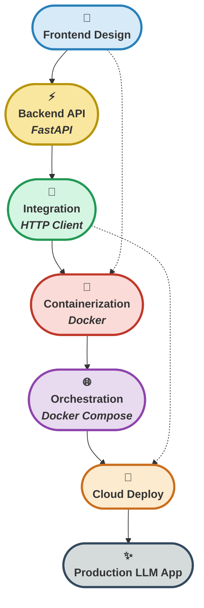

# 🎯 **Hafta 7: LLM Application Deployment - Frontend, Backend ve Docker**


---

## 📁 Dosya Yapısı

Bu klasördeki ana dosyalar ve içerikleri:

| Dosya Adı                           | Açıklama                                                                                        |
|-------------------------------------|-------------------------------------------------------------------------------------------------|
| `1_gradio_frontend.py`              | Gradio ile hızlı prototipleme, chatbot arayüzü, streaming output ve multi-modal uygulamalar    |
| `2_streamlit_frontend.py`           | Streamlit ile data-centric web uygulaması, session state yönetimi ve widget'lar                |
| `3_fastapi_backend.py`              | FastAPI ile RESTful API, async endpoints, Pydantic validation ve OpenAPI docs                  |
| `4_fastapi_integration.py`          | Frontend-Backend entegrasyonu, HTTP requests, error handling ve retry mekanizmaları             |
| `5_docker_setup.py`                 | Docker automation script, image build, container yönetimi ve docker-compose entegrasyonu       |
| `Dockerfile`                        | Backend API için Docker image tanımı ve production build configuration                          |
| `Dockerfile.gradio`                 | Gradio frontend için Docker image tanımı ve optimizasyon ayarları                              |
| `Dockerfile.streamlit`              | Streamlit frontend için Docker image tanımı ve deployment konfigürasyonu                       |
| `docker-compose.yml`                | Multi-container orchestration, service networking ve production deployment                      |
| `requirements.txt`                  | Python dependencies (Gradio, Streamlit, FastAPI, OpenAI, Docker utilities)                     |
| `DERS_NOTLARI.md`                   | Detaylı ders içeriği, konsept açıklamaları ve best practices                                   |
| `ders_notu_docker_deployment.md`    | Docker ve containerization detaylı eğitim notu, production deployment stratejileri             |
| `SETUP.md`                          | Kurulum rehberi, environment setup ve troubleshooting                                           |
| `README.md`                         | Haftanın özeti, kullanım talimatları, teknik açıklamalar ve deployment guide                   |

Her dosya, modern web framework'leri, RESTful API tasarımı, containerization teknikleri ve production-ready deployment implementasyonlarını detaylı örneklerle gösterir.

---

## 🎯 Haftanın Özeti

Bu hafta, **LLM tabanlı uygulamaları production ortamına dağıtma** süreçlerinin profesyonel düzeyde uygulanmasını öğrendim. **Gradio** ve **Streamlit** ile modern frontend arayüzleri nasıl oluşturacağımı, **FastAPI** ile yüksek performanslı RESTful API'ler nasıl tasarlayacağımı, frontend-backend entegrasyonunu nasıl gerçekleştireceğimi ve **Docker** ile **Docker Compose** kullanarak uygulamaları nasıl containerize edip production'a deploy edeceğimi öğrendim.

Her aşamada, rapid prototyping teknikleri, async/await best practices, CORS configuration, API documentation, image optimization, multi-container orchestration ve production deployment stratejileri ile LLM uygulamalarını gerçek dünya senaryolarında nasıl kullanabileceğimi pratik örneklerle deneyimledim.

Kodlarda, detaylı açıklamalar ve step-by-step implementasyonlar ile hem temel kavramları hem de enterprise-grade deployment pipeline'ının nasıl oluşturulacağını kapsamlı örneklerle sundum.

### 🚀 Temel Öğrenme Hedefleri

Bu hafta edindiğim ana yetkinlikler:

- 🎨 **Frontend Development**: Gradio ile hızlı prototipleme, Streamlit ile data-centric uygulamalar
- ⚡ **Backend API**: FastAPI ile async RESTful API, Pydantic validation ve OpenAPI documentation
- 🔗 **Integration**: Frontend-Backend entegrasyonu, HTTP client yapılandırması ve error handling
- 🐳 **Containerization**: Docker image build, multi-stage builds ve optimization stratejileri
- 🌐 **Orchestration**: Docker Compose ile multi-container deployment ve service networking
- 📦 **Production Deployment**: Cloud deployment (AWS, Azure, GCP), CI/CD ve monitoring

---

## 🚦 LLM Application Deployment Pipeline Yolculuğu

<p align="center" style="font-size:1.1em;">
	<b>🎯 Gradio/Streamlit → FastAPI → Docker → Production<br>
	<span style="color:#2980B9;">Modern Frontend</span> ile <span style="color:#CA6F1E;">scalable backend</span>, <span style="color:#229954;">containerized</span> ve <span style="color:#8E44AD;">production-ready</span> LLM uygulamaları!</b>
</p>



<p align="center" style="font-size:1.1em; margin-top:10px;">
	<b>✨ <span style="color:#229954;">Gradio/Streamlit</span> ile <span style="color:#C0392B;">hızlı prototipleme</span>, <span style="color:#CA6F1E;">FastAPI</span> ile <span style="color:#8E44AD;">scalable backend</span> ve <span style="color:#2980B9;">Docker</span> ile <span style="color:#229954;">production deployment</span>! ✨</b>
</p>

---

## 📚 İçerik

### 1. Gradio ile Frontend - Hızlı Prototipleme  
**Dosya:** `1_gradio_frontend.py`  
- **Gradio Framework:** Python tabanlı web UI oluşturma, otomatik interface generation
- **Chatbot Interface:** `gr.ChatInterface()` ile sohbet arayüzü, message history yönetimi
- **Streaming Output:** `yield` ile real-time text generation, typewriter efekti
- **File Upload:** `gr.File()` ile PDF, TXT, DOCX dosya analizi ve processing
- **Multi-tab Application:** `gr.Tabs()` ile çoklu sayfa yapısı ve navigation
- **Customization:** Theme ayarları, CSS styling ve component configuration
- **OpenAI Integration:** Chat completions API, streaming responses ve error handling

**Teknik Detaylar:**
```python
# Gradio Chatbot Interface
def streaming_chatbot(message, history):
    """Streaming yanıt ile chatbot"""
    messages = [{"role": "system", "content": "Sen yardımcı bir asistansın."}]
    
    # History'yi formatla
    for msg in history:
        messages.append({"role": "user", "content": msg[0]})
        messages.append({"role": "assistant", "content": msg[1]})
    
    messages.append({"role": "user", "content": message})
    
    # Streaming response
    response = client.chat.completions.create(
        model="gpt-3.5-turbo",
        messages=messages,
        stream=True  # Streaming aktif
    )
    
    partial_response = ""
    for chunk in response:
        if chunk.choices[0].delta.content:
            partial_response += chunk.choices[0].delta.content
            yield partial_response  # Her chunk'ı anında gönder

# Gradio arayüzü oluştur
demo = gr.ChatInterface(
    fn=streaming_chatbot,
    title="🤖 AI Chatbot",
    description="OpenAI GPT ile sohbet edin",
    theme=gr.themes.Soft(),
    examples=["Merhaba!", "Python nedir?", "Bir şiir yaz"]
)

demo.launch(server_name="0.0.0.0", server_port=7860)
```

---

### 2. Streamlit ile Frontend - Data-Centric Uygulamalar  
**Dosya:** `2_streamlit_frontend.py`  
- **Streamlit Framework:** Data science odaklı web framework, reactive programming
- **Session State Management:** `st.session_state` ile kullanıcı oturumu yönetimi
- **Widget System:** `st.button()`, `st.slider()`, `st.selectbox()` interaktif öğeler
- **Chat Interface:** `st.chat_message()` ve `st.chat_input()` ile modern sohbet UI
- **Sidebar Configuration:** `st.sidebar` ile ayarlar paneli, parameter tuning
- **Data Visualization:** Plotly entegrasyonu, charts ve graphs
- **Caching:** `@st.cache_data` ile performans optimizasyonu
- **Layout System:** `st.columns()`, `st.tabs()` ile responsive design

**Best Practices:**
```python
# Streamlit Session State Yönetimi
if "messages" not in st.session_state:
    st.session_state.messages = []

# Sidebar configuration
with st.sidebar:
    st.title("⚙️ Ayarlar")
    model = st.selectbox("Model:", ["gpt-3.5-turbo", "gpt-4"])
    temperature = st.slider("Temperature:", 0.0, 1.0, 0.7, 0.1)
    max_tokens = st.slider("Max Tokens:", 50, 500, 150, 50)

# Chat interface
for message in st.session_state.messages:
    with st.chat_message(message["role"]):
        st.markdown(message["content"])

# User input
if prompt := st.chat_input("Mesajınızı yazın..."):
    # Add user message
    st.session_state.messages.append({"role": "user", "content": prompt})
    with st.chat_message("user"):
        st.markdown(prompt)
    
    # Generate response
    with st.chat_message("assistant"):
        message_placeholder = st.empty()
        full_response = ""
        
        for chunk in client.chat.completions.create(
            model=model,
            messages=st.session_state.messages,
            temperature=temperature,
            max_tokens=max_tokens,
            stream=True
        ):
            if chunk.choices[0].delta.content:
                full_response += chunk.choices[0].delta.content
                message_placeholder.markdown(full_response + "▌")
        
        message_placeholder.markdown(full_response)
    
    st.session_state.messages.append({"role": "assistant", "content": full_response})
```

---

### 3. FastAPI ile Backend - RESTful API Tasarımı  
**Dosya:** `3_fastapi_backend.py`  
- **FastAPI Framework:** Modern, fast (high-performance) web framework
- **Pydantic Models:** Data validation, serialization ve schema generation
- **Async Endpoints:** `async def` ile non-blocking I/O operations
- **CORS Middleware:** Cross-Origin Resource Sharing configuration
- **OpenAPI Documentation:** Otomatik Swagger UI ve ReDoc generation
- **Streaming Responses:** `StreamingResponse` ile real-time data streaming
- **Error Handling:** `HTTPException` ile structured error responses
- **Health Checks:** `/health` endpoint ile service monitoring
- **Type Hints:** Python type annotations ile code safety

**API Architecture:**
```python
from fastapi import FastAPI, HTTPException
from fastapi.middleware.cors import CORSMiddleware
from fastapi.responses import StreamingResponse
from pydantic import BaseModel, Field
from typing import List, Optional
import json

app = FastAPI(
    title="LLM Backend API",
    description="LLM tabanlı uygulamalar için RESTful API",
    version="1.0.0"
)

# CORS Configuration
app.add_middleware(
    CORSMiddleware,
    allow_origins=["*"],  # Production'da spesifik domain'ler
    allow_credentials=True,
    allow_methods=["*"],
    allow_headers=["*"],
)

# Pydantic Models
class ChatMessage(BaseModel):
    role: str = Field(..., description="user veya assistant")
    content: str = Field(..., description="Mesaj içeriği")

class ChatRequest(BaseModel):
    messages: List[ChatMessage]
    model: str = Field(default="gpt-3.5-turbo")
    temperature: float = Field(default=0.7, ge=0.0, le=2.0)
    max_tokens: int = Field(default=150, ge=1, le=4000)
    stream: bool = Field(default=False)

# Chat Endpoint
@app.post("/chat")
async def chat_endpoint(request: ChatRequest):
    """Chat completion endpoint"""
    try:
        if request.stream:
            # Streaming response
            async def generate():
                response = client.chat.completions.create(
                    model=request.model,
                    messages=[msg.dict() for msg in request.messages],
                    temperature=request.temperature,
                    max_tokens=request.max_tokens,
                    stream=True
                )
                
                for chunk in response:
                    if chunk.choices[0].delta.content:
                        yield f"data: {json.dumps({'content': chunk.choices[0].delta.content})}\n\n"
                
                yield "data: [DONE]\n\n"
            
            return StreamingResponse(generate(), media_type="text/event-stream")
        else:
            # Normal response
            response = client.chat.completions.create(
                model=request.model,
                messages=[msg.dict() for msg in request.messages],
                temperature=request.temperature,
                max_tokens=request.max_tokens
            )
            
            return {
                "response": response.choices[0].message.content,
                "model": request.model,
                "tokens_used": response.usage.total_tokens
            }
    
    except Exception as e:
        raise HTTPException(status_code=500, detail=str(e))

# Health Check
@app.get("/health")
async def health_check():
    """Service health check"""
    return {
        "status": "healthy",
        "timestamp": datetime.now().isoformat(),
        "api_key_configured": bool(os.getenv("OPENAI_API_KEY"))
    }
```

---

### 4. Frontend-Backend Entegrasyonu  
**Dosya:** `4_fastapi_integration.py`  
- **HTTP Client Configuration:** `requests` ve `httpx` ile API çağrıları
- **Error Handling:** Connection errors, timeouts ve retry logic
- **Request/Response Management:** JSON serialization ve deserialization
- **Environment Variables:** API base URL ve configuration management
- **Async Communication:** Asenkron request handling
- **Streaming Integration:** Server-Sent Events (SSE) ile real-time updates
- **Fallback Mechanisms:** API failure durumunda graceful degradation
- **Loading States:** User feedback ile better UX

**Integration Pattern:**
```python
import requests
import os
from typing import Optional, List, Dict

# API Base URL
API_BASE_URL = os.getenv("API_BASE_URL", "http://localhost:8000")

def chat_with_backend(
    messages: List[Dict[str, str]],
    model: str = "gpt-3.5-turbo",
    temperature: float = 0.7,
    max_tokens: int = 150,
    timeout: int = 30
) -> Optional[str]:
    """Backend API ile chat"""
    try:
        response = requests.post(
            f"{API_BASE_URL}/chat",
            json={
                "messages": messages,
                "model": model,
                "temperature": temperature,
                "max_tokens": max_tokens,
                "stream": False
            },
            timeout=timeout
        )
        
        response.raise_for_status()
        return response.json()["response"]
    
    except requests.exceptions.ConnectionError:
        print("❌ Backend API'ye bağlanılamadı!")
        return None
    except requests.exceptions.Timeout:
        print("⏱️ Request timeout!")
        return None
    except Exception as e:
        print(f"❌ Hata: {e}")
        return None
```

---

### 5. Docker ile Containerization  
**Dosyalar:** `Dockerfile`, `Dockerfile.gradio`, `Dockerfile.streamlit`, `docker-compose.yml`  
- **Docker Basics:** Images, containers, volumes ve networks
- **Dockerfile Best Practices:** Multi-stage builds, layer caching, image size optimization
- **Environment Management:** `.env` files, secrets ve configuration
- **Port Mapping:** Host-container port binding ve network configuration
- **Volume Mounting:** Data persistence ve log management
- **Health Checks:** Container health monitoring ve automatic recovery
- **Docker Compose:** Multi-container orchestration, service dependencies
- **Production Setup:** Resource limits, restart policies ve logging

**Docker Compose Configuration:**
```yaml
version: '3.8'

services:
  # Backend API
  backend:
    build:
      context: .
      dockerfile: Dockerfile
    container_name: llm-backend
    ports:
      - "8000:8000"
    environment:
      - OPENAI_API_KEY=${OPENAI_API_KEY}
    env_file:
      - .env
    volumes:
      - ./logs:/app/logs
    restart: unless-stopped
    healthcheck:
      test: ["CMD", "curl", "-f", "http://localhost:8000/health"]
      interval: 30s
      timeout: 10s
      retries: 3
    networks:
      - llm-network

  # Gradio Frontend
  gradio-frontend:
    build:
      context: .
      dockerfile: Dockerfile.gradio
    container_name: llm-gradio
    ports:
      - "7860:7860"
    environment:
      - API_BASE_URL=http://backend:8000
    depends_on:
      - backend
    restart: unless-stopped
    networks:
      - llm-network

  # Streamlit Frontend
  streamlit-frontend:
    build:
      context: .
      dockerfile: Dockerfile.streamlit
    container_name: llm-streamlit
    ports:
      - "8501:8501"
    environment:
      - API_BASE_URL=http://backend:8000
    depends_on:
      - backend
    restart: unless-stopped
    networks:
      - llm-network

networks:
  llm-network:
    driver: bridge
```

---

## 🛠️ Kurulum ve Kullanım

### 📦 Gereksinimler

```txt
# Ana bağımlılıklar
gradio>=4.0.0
streamlit>=1.28.0
fastapi>=0.104.0
uvicorn[standard]>=0.24.0
openai>=1.0.0

# HTTP clients
requests>=2.31.0
httpx>=0.25.0

# Utilities
python-dotenv>=1.0.0
pydantic>=2.0.0
pandas>=2.0.0
plotly>=5.17.0
```

### 🚀 Hızlı Başlangıç

#### 1. Sanal Ortam ve Dependencies
```powershell
# Windows PowerShell
cd hafta_7

# Virtual environment oluştur
python -m venv venv
.\venv\Scripts\Activate.ps1

# Dependencies yükle
pip install --upgrade pip
pip install -r requirements.txt
```

#### 2. Environment Variables
```powershell
# .env dosyası oluştur
New-Item -Path ".env" -ItemType File
```

`.env` içeriği:
```env
OPENAI_API_KEY=your-openai-api-key-here
HUGGINGFACE_API_KEY=your-huggingface-key-here
API_BASE_URL=http://localhost:8000
```

#### 3. Uygulamaları Çalıştır

**Gradio Frontend:**
```powershell
python 1_gradio_frontend.py
# http://localhost:7860
```

**Streamlit Frontend:**
```powershell
streamlit run 2_streamlit_frontend.py
# http://localhost:8501
```

**FastAPI Backend:**
```powershell
uvicorn 3_fastapi_backend:app --reload --host 0.0.0.0 --port 8000
# http://localhost:8000/docs
```

#### 4. Docker ile Deployment

**Docker Compose (Önerilen):**
```powershell
# Tüm servisleri başlat
docker-compose up -d

# Durum kontrol
docker-compose ps

# Logları izle
docker-compose logs -f

# Servisleri durdur
docker-compose down
```

**Automation Script:**
```powershell
python 5_docker_setup.py
```

---

## 💡 En İyi Uygulamalar

### Frontend Best Practices
```python
# ✅ İyi: Error handling ve loading states
def chat_response(message):
    try:
        with st.spinner("AI düşünüyor..."):
            response = call_api(message)
        return response
    except Exception as e:
        st.error(f"Hata: {e}")
        return None
```

### Backend Best Practices
```python
# ✅ İyi: Pydantic validation ve type hints
@app.post("/chat")
async def chat(request: ChatRequest) -> ChatResponse:
    # Type safety ve auto validation
    pass
```

### Docker Best Practices
```dockerfile
# ✅ İyi: Multi-stage build
FROM python:3.10-slim as builder
RUN pip install -r requirements.txt

FROM python:3.10-slim
COPY --from=builder /opt/venv /opt/venv
USER appuser
```

---

## 📊 Performans Karşılaştırması

| Metrik | Development | Docker (Single) | Docker Compose | Production (ECS) |
|--------|-------------|-----------------|----------------|------------------|
| **Startup Time** | 2-3s | 5-10s | 15-20s | 30-60s |
| **Response Latency** | 50-100ms | 70-150ms | 100-200ms | 150-300ms |
| **Throughput** | 10-20 req/s | 50-100 req/s | 100-200 req/s | 500-1000+ req/s |
| **Scalability** | ❌ | ⚠️ Manuel | ✅ Kolay | ✅✅ Otomatik |

---

## 🎓 Ek Kaynaklar

<details>
<summary>📘 Gradio Documentation</summary>
<a href="https://www.gradio.app/docs/">https://www.gradio.app/docs/</a>
</details>

<details>
<summary>⚡ Streamlit Documentation</summary>
<a href="https://docs.streamlit.io/">https://docs.streamlit.io/</a>
</details>

<details>
<summary>📑 FastAPI Documentation</summary>
<a href="https://fastapi.tiangolo.com/">https://fastapi.tiangolo.com/</a>
</details>

<details>
<summary>📝 Docker Documentation</summary>
<a href="https://docs.docker.com/">https://docs.docker.com/</a>
</details>

<details>
<summary>🔄 Docker Compose Guide</summary>
<a href="https://docs.docker.com/compose/">https://docs.docker.com/compose/</a>
</details>

---

## 💡 İpuçları

### 🎯 Frontend Development
- Component reusability ile modüler tasarım
- Her component'te error handling
- Loading states ile user feedback
- Responsive design testing

### ⚡ Backend API
- Async/await ile I/O-bound işlemler
- Pydantic ile data validation
- Structured error messages
- API versioning (/v1/, /v2/)

### 🚀 Docker
- Layer caching optimization
- Multi-stage builds
- .dockerignore kullanımı
- Health checks
- Resource limits

### 🔒 Security
- Environment variables
- HTTPS kullanımı
- Non-root user
- Secret management
- CORS whitelist

---

<p align="center" style="font-size:1.1em;">
	<b>🌟 <span style="color:#CA6F1E;">Gradio + Streamlit + FastAPI + Docker</span>, <span style="color:#229954;">modern LLM uygulamalarının deployment stack'i!</span> 🌟</b>
</p>

<br>

## 🎉 Sonuç

Bu hafta, **LLM tabanlı uygulamaları production ortamına dağıtma** süreçlerini kapsamlı şekilde öğrendik. Gradio ile hızlı prototipleme, Streamlit ile data-centric uygulamalar, FastAPI ile yüksek performanslı RESTful API'ler ve Docker ile containerization yaparak modern deployment pipeline'ı oluşturmayı deneyimledik.

**Öğrendiklerimiz:**

✅ Gradio ile hızlı prototipleme ve chatbot arayüzleri  
✅ Streamlit ile data visualization ve session state yönetimi  
✅ FastAPI ile async RESTful API ve Pydantic validation  
✅ Frontend-Backend entegrasyonu ve error handling  
✅ Docker image build ve multi-stage optimization  
✅ Docker Compose ile multi-container orchestration  
✅ Production deployment stratejileri  
✅ Security best practices ve monitoring  

**Başarılar! 🚀**

---

<p align="center">
	<b>Kairu AI - Build with LLMs Bootcamp | Hafta 7</b><br>
	<i>LLM Application Deployment - Frontend, Backend ve Production Infrastructure</i><br>
	<i>🐳 Bonus: Docker Containerization ve Cloud Deployment Stratejileri</i>
</p>
